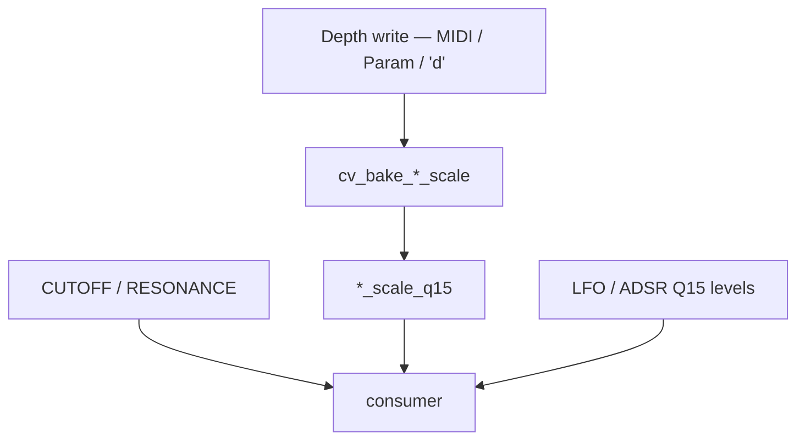

# CV mod depth scales

Soft VCA / VCF modulation depths are **baked into gain scales** when a panel depth changes, then
applied with a single multiply. This doc is the human reference for those bakers and the peak
math.

> ⚠️ **Scope changed on this board.** The three bakers and everything they feed are now compiled
> **only under `ENABLE_CV_OUTS`**, which is **off** in the shipping tree — the STM32 Mainboard
> owns VCA/VCF/resonance analog. The bake *pattern* is still the house style and is used live in
> other domains (pitch, PW, Character); see [§7](#7-related-bake-patterns-live-on-this-board).
> The formulas were also rewritten from divisions to shifts. See
> [§8](#8-what-changed).

Related: hot path [`UPDATE_CV_OUTS_HOT_PATH.md`](UPDATE_CV_OUTS_HOT_PATH.md), matrix
[`MOD_MATRIX.md`](MOD_MATRIX.md), Character bake pattern [`CHARACTER.md`](CHARACTER.md).

Code: [`cv_out.ino`](../cv_out.ino), state in [`cv_state.h`](../cv_state.h).

---

## 1. Purpose

Panel depths (`ADSR2toVCF`, `LFO2toVCF`, `LFO1toVCA`) are not applied with divides every CV tick.
On write:

1. A **baker** turns depth → precomputed scale (`*_scale_q15`).
2. The consumer does `(src * scale) >> 15`.

**Mental model, everywhere in this codebase:** expensive depth math on knob/CC write; hot path is
`Q15 × scale >> 15` (or Q24 for pitch).

---

## 2. The three bakers (live source)

```cpp
void cv_bake_adsr2_to_vcf_scale() { ADSR2toVCF_scale_q15 =  (int32_t)ADSR2toVCF << 3; }
void cv_bake_lfo2_to_vcf_scale()  { LFO2toVCF_scale_q15  = -((int32_t)LFO2toVCF << 2); }
void cv_bake_lfo1_to_vca_scale()  { LFO1toVCA_scale_q15  = -((int32_t)LFO1toVCA << 2); }

void cv_update_mod_scales() {
  cv_bake_adsr2_to_vcf_scale();
  cv_bake_lfo2_to_vcf_scale();
  cv_bake_lfo1_to_vca_scale();
}
```

| Baker | Input | Output | Polarity | Shift | Effective multiplier |
|---|---|---|:---:|:---:|---|
| `cv_bake_adsr2_to_vcf_scale` | `ADSR2toVCF` | `ADSR2toVCF_scale_q15` | **+** | `<< 3` | ×8 |
| `cv_bake_lfo2_to_vcf_scale` | `LFO2toVCF` | `LFO2toVCF_scale_q15` | **−** | `<< 2` | ×4 |
| `cv_bake_lfo1_to_vca_scale` | `LFO1toVCA` | `LFO1toVCA_scale_q15` | **−** | `<< 2` | ×4 |

LFO scales are **negative** so polarity matches the absorbed Mainboard CV path.

`cv_update_mod_scales()` calls all three; it runs at boot from `init_cv_out()`. Prefer the
per-depth baker when only one depth changed.

---

## 3. Why ADSR shifts by 3 and LFO by 2

The 2:1 ratio between them is the whole point, and it is **unchanged** from the division-based
formulas — only the arithmetic got cheaper.

| | Old formula | New | At depth 512 |
|---|---|---|---:|
| ADSR2→VCF | `(d * 4095) / 512` | `d << 3` | 4095 → **4096** |
| LFO2→VCF | `−(d * 4095) / 1024` | `−(d << 2)` | −2048 → **−2048** |

The shift form divides by **4096** instead of 4095 — a 1-LSB difference at full scale, exact
everywhere the old form was, and free of a runtime divide.

**Why ADSR is twice as deep as LFO:**

- **ADSR is unipolar.** Envelope peak ≈ full scale, so panel full depth should map to the full
  0..4095 CV span → divide by `512`.
- **LFO is bipolar.** It historically lived in a CC-count domain where the peak was at **half**
  of `dacSize`. Keeping that half-factor means dividing by `512 × 2 = 1024`.

If the LFO bakers ever get "simplified" to `<< 3`, LFO→VCA and LFO→VCF become about **twice as
deep** as the pre-Q15 synth. That half-factor is deliberate.

---

## 4. Domains and constants

| Symbol | Value | Meaning |
|--------|------:|---------|
| Panel depth | 0..512 | `ADSR2toVCF`, `LFO2toVCF`, `LFO1toVCA` |
| `CV_U12_MAX` | 4095 | Soft CV / 12-bit DAC clamp |
| Q15 +1.0 | 32768 | Hot multiply: `(a * b) >> 15` |

> ❌ **`CV_PANEL_DEPTH_FULL` (512) and `CV_LFO_Q15_PEAK_DIV` (1024) no longer exist.** They were
> the divisors in the old formulas; the shifts replaced them. `CV_U12_SCALE` (4096) is also gone
> — `cv_q15_to_u12()` is now a plain `>> 3`.
>
> `CV_U12_MAX` and the three helpers below are inside `#ifdef ENABLE_CV_OUTS`, so on the
> shipping build they are not compiled at all.

Helpers (also `ENABLE_CV_OUTS`-gated):

```cpp
cv_clamp_u12(v)          // 0 .. CV_U12_MAX
lerp_0_4095(x, y0, y1)   // y0 + ((y1 - y0) * x) >> 12   — divide by 4096, not 4095
cv_q15_to_u12(q15)       // cv_clamp_u12(q15 >> 3)
```

Live modulation sources:

| Source | Global | Domain |
|--------|--------|--------|
| EnvVCF / EnvVCF2 | `ADSR_VCF_Level_q15`, `ADSR_VCF2_Level_q15` | Q15 unipolar |
| LFO1 / LFO2 / LFO3 | `LFO1Level`, `LFO2Level`, `LFO3Level` | Q15 bipolar |
| Drift LFO | `LFO_DRIFT_LEVEL[]` | Q15 bipolar |

CUTOFF and RESONANCE are **not** baked — they are read live.

---

## 5. When to call

| Writer | File | Baker |
|--------|------|-------|
| Boot `init_cv_out()` | [`cv_out.ino`](../cv_out.ino) | `cv_update_mod_scales()` — inside `#ifdef ENABLE_CV_OUTS` |
| Filter block `'d'` | [`Serial.ino`](../Serial.ino) | `cv_bake_adsr2_to_vcf_scale` + `cv_bake_lfo2_to_vcf_scale` |
| MIDI `CC_LOCAL_FILTER_ADSR2_TO_VCF` | [`midi.ino`](../midi.ino) | `cv_bake_adsr2_to_vcf_scale` |
| MIDI `CC_LOCAL_FILTER_LFO2_TO_VCF` | [`midi.ino`](../midi.ino) | `cv_bake_lfo2_to_vcf_scale` |
| `PARAM_LFO1_TO_VCA` | [`params.ino`](../params.ino) | `cv_bake_lfo1_to_vca_scale` |
| CUTOFF / RESONANCE | — | **none** — used live |

`'d'` carries CUTOFF, RESONANCE and the two VCF depths in one frame. The scales refresh because
of the **depths**, not because of cutoff/reso.



---

## 6. Where the scales are consumed

**Not in `update_CV_outs()` on this board.** That function is now a five-stage matrix pipeline
that produces per-voice pitch / PW / crossmod deltas and writes no CVs
([`UPDATE_CV_OUTS_HOT_PATH.md`](UPDATE_CV_OUTS_HOT_PATH.md)).

The combine these scales were written for — `(EnvVCF × ADSR2toVCF_scale) >> 15` summed with LFO2,
CUTOFF, drift and matrix cutoff, then velocity and keytrack, then the `4095 − clamp` inversion —
runs on the **STM32 Mainboard**, from the `'d'` block and parameter frames the DCO forwards.

The bakers stay in the DCO tree so that:

- the DCO keeps a correct shadow of panel depth state for preset records, and
- enabling `ENABLE_CV_OUTS` for a future expansion brings the whole path back with the right
  scaling.

---

## 7. Related bake patterns (live on this board)

These use the same idea in domains the DCO **does** own, and they are compiled unconditionally:

| Path | Where | Pattern |
|------|--------|---------|
| LFO → pitch | [`params.ino`](../params.ino) → `*_q24` | `lfo_pitch_depth_q24(amt, LFO*_PITCH_DEPTH_SCALE)` — scales 1700 / 512 / 1000 in [`LFO.h`](../LFO.h) |
| EnvDCO → pitch | `ADSR1toDETUNE1_scale_q24` | exp knob → norm × `ADSR_PITCH_MAX_OCTAVES` → Q24; hot `applyDepthQ24(env_dco_pitch_wave_q15(env), depth)` |
| Drift → pitch | `drift_pitch_scale_q24` | `analogDrift × DRIFT_PITCH_UNIT_Q24 × DRIFT_PITCH_DEPTH_SCALE` |
| ADSR → PW | `ADSR1toPWM_scale` | `(q15 * scale) >> 15` |
| Character | [`CHARACTER.md`](CHARACTER.md) | `character_recompute_scales()` → `char_pitch/amp/pw_scale_q15` |
| Matrix depths | [`MOD_MATRIX.md`](MOD_MATRIX.md) | `(src_q15 * depth) >> 15` per slot, per voice |

---

## 8. What changed

| Topic | Previous revision | Current |
|---|---|---|
| Compilation | Always built | **`#ifdef ENABLE_CV_OUTS`** — off in the shipping tree |
| ADSR2→VCF bake | `(d * CV_U12_MAX) / CV_PANEL_DEPTH_FULL` | **`d << 3`** |
| LFO2→VCF bake | `−(d * CV_U12_MAX) / CV_LFO_Q15_PEAK_DIV` | **`−(d << 2)`** |
| LFO1→VCA bake | same algebra as LFO2 | **`−(d << 2)`** |
| `CV_PANEL_DEPTH_FULL` | 512 | **Removed** |
| `CV_LFO_Q15_PEAK_DIV` | 1024 | **Removed** |
| `CV_U12_SCALE` | 4096 | **Removed** — `cv_q15_to_u12` is `>> 3` |
| Float A/B formulas | Documented per baker | **Gone** — the bakers are integer-only now |
| Consumer | `update_CV_outs` VCA/VCF combine | Mainboard; `update_CV_outs` writes no CVs |
| `cv_out.h` | Listed as the API header | **Does not exist** — declarations are in `cv_state.h` / the sketch |
| Effective divisor | 4095 | 4096 (shift) — 1 LSB at full scale |
| Depth ratio ADSR : LFO | 2 : 1 | **2 : 1 — unchanged** |

---

## 9. File map

| File | Role |
|------|------|
| [`cv_out.ino`](../cv_out.ino) | Bakers, helpers, `init_cv_out()`, the matrix pipeline |
| [`cv_state.h`](../cv_state.h) | Depth globals + `*_scale_q15` |
| [`cv_bezier.h`](../cv_bezier.h) | `generateBezierArray` for `AS2164_VCA_linearize_table` |
| [`Serial.ino`](../Serial.ino) | `'d'` → two VCF bakers |
| [`midi.ino`](../midi.ino) | Per-depth MIDI bake |
| [`params.ino`](../params.ino) | `PARAM_LFO1_TO_VCA` + drift scale assign |
| [`LFO.h`](../LFO.h) | Pitch depth scales (a different, always-live bake domain) |
