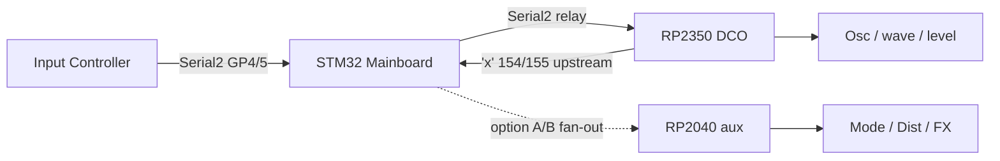

# Dual MCU voice path (RP2350 + RP2040 aux)

**Status: architecture + firmware scaffold.** Helper sketch:
[`../../VOICE-AUX/`](../../VOICE-AUX/).

> 🔴 **Rewritten 2026-09-16.** Two classes of error: the ParamIds were all wrong (Dist **58/59**
> not 52/53, filter mode **60** not 54, matrix slots **63–86** not 60–83, and 55–56 are EnvDCO
> curves, not reserved for FX), and the **link topology no longer matches this instrument** —
> the DCO has no direct Input UART to fan out. See [§8](#8-what-changed).

Related: [`SYSTEM_OVERVIEW.md`](SYSTEM_OVERVIEW.md), [`PINOUT.md`](PINOUT.md),
[`FILTER_ROUTING.md`](FILTER_ROUTING.md), [`DISTORTION.md`](DISTORTION.md),
[`../../VOICE-AUX/docs/README.md`](../../VOICE-AUX/docs/README.md).

---

## 1. Why

GPIO / PWM headroom without mandating an **RP2350B**. With 8 oscillators the DCO's pin budget is
effectively exhausted ([`PINOUT.md`](PINOUT.md)): every draft CV pin collides with a RESET or
RANGE line, and only **GP6** is genuinely free.

| MCU | Role |
|-----|------|
| **RP2350 (DCO)** | Oscillators, osc switching / levels, MIDI, Mainboard link, filter **cutoff/reso** CV, main **VCA** CV |
| **RP2040 (aux)** | Post-filter controls: AS3320 mode, distortion Drive/Mix, effects — everything after the filter **except** Cut/Res/VCA |

**Alternate:** a single **RP2350B** can run the full stack alone. The `DCO6/` firmware must
**keep** code paths for everything the aux would own so that build stays viable.

> On this instrument the **STM32 Mainboard already owns VCA/VCF/resonance analog**
> ([`UPDATE_CV_OUTS_HOT_PATH.md`](UPDATE_CV_OUTS_HOT_PATH.md)). The "critical CVs" column above
> describes the solo-board configuration where `ENABLE_CV_OUTS` is on — it is **off** in the
> shipping tree. Settle who owns what before building the aux.

---

## 2. ⚠️ The link topology has changed

The original design assumed the DCO sat directly on the Input bus, so the aux could be added by
**fanning out Input TX** to a second RX pin.

**That wire no longer exists.** On the classic DCO4 wiring the DCO's only peer UART is the STM32
Mainboard:

```
Input <--Serial8--> Mainboard <--Serial2--> DCO <--USB CDC--> host
```

Panel traffic reaches the DCO **relayed**, already filtered by the Mainboard's relay tables.
So a fan-out has to tap one of the links that actually exist:

| Option | Tap | Notes |
|---|---|---|
| **A** | Input TX → Mainboard `Serial8`, fan out to aux RX | Aux sees raw panel frames, same as the original plan. Needs a stub at the Input end |
| **B** | Mainboard TX → DCO `Serial2` (GP21), fan out to aux RX | Aux sees only what the Mainboard **chose to relay** — a command absent from `mainSerial2Commands[]` never arrives |
| **C** | Mainboard gains a dedicated aux link | Cleanest, costs a UART on the STM32 |

**Option B is the trap.** Dist/mode ParamIds arrive as `'p'` frames, and the Mainboard applies
`'p'` through its own `paramTable[]` and re-emits DCO-owned ids with `forward_dco()` — so an id
the Mainboard does not know about is **not forwarded at all**. Any aux hanging off Serial2 needs
those ids added to the Mainboard's forward table first.



**Nothing upstream from the aux** — it never drives a bus. Only the DCO transmits upstream
(`'x'` 154 gap, 155 cal offset).

**Boot gap:** prefer a **periodic full snapshot** from Input (or resend on demand) so a
late-powered aux catches up. Do not rely on the DCO mirroring params to it.

---

## 3. Ownership split

### RP2350 DCO (`DCO6/`) — always

| Domain | Examples |
|--------|----------|
| Oscillators | PIO DCO, sync, calibration, RESET / RANGE / PW |
| Osc switching | Dual 74HC595 → 3× DG411 ([`WAVE_MUX.md`](WAVE_MUX.md)) — `ENABLE_WAVE_MUX` off |
| Osc levels | OSC1/2 + Sub PWM → level VCAs |
| Critical CVs | Filter cutoff ×2, resonance ×2, main VCA — **only when `ENABLE_CV_OUTS` is on** |
| Links | Mainboard `Serial2`; MIDI USB + DIN |
| Envelopes / LFOs / matrix | Full state, on Core 0 |
| Presets | The instrument's only 256-slot store ([`PRESET_STORE.md`](PRESET_STORE.md)) |

### RP2040 aux — dual-MCU build

| Domain | Examples |
|--------|----------|
| Filter mode | AS3320 multimode GPIOs → DG411/4066 ([`FILTER_ROUTING.md`](FILTER_ROUTING.md)) |
| Distortion | Drive / Mix PWM ([`DISTORTION.md`](DISTORTION.md)) |
| Effects | FV-1 program / digitals (later) |
| I2S listen | PCM5102 noise listen — [`VOICE-AUX/docs/I2S_NOISE.md`](../../VOICE-AUX/docs/I2S_NOISE.md); **not** on the DCO |
| Other | Post-filter switches, mutes, slow controls |

---

## 4. Live ParamId ownership

| Domain | IDs | Dual-MCU owner |
|--------|-----|----------------|
| Osc / wave / level / notes / ADSR / LFO | `'a'`–`'d'`, `'p'`, mux, level PWM | **DCO** |
| Cut / Res / VCA | `'d'`, envelopes, `PARAM_VCA_LEVEL` **43** | **DCO** (or Mainboard — see §1) |
| Dist Drive / Mix | `PARAM_DIST_DRIVE` **58**, `PARAM_DIST_MIX` **59** | **aux** |
| AS3320 mode | `PARAM_FILTER_MODE` **60** | **aux** |
| Mod matrix slots | ParamIds **63–86** (8 slots × source/dest/depth) | **both** — see below |
| Upstream `'x'` 154 / 155 | DCO TX only | **DCO** |

> ❌ **There is no FX id reservation at 55–56.** Those are `PARAM_ADSR3_DECAY_CURVE` and
> `PARAM_ADSR3_RELEASE_CURVE`. Free ranges for future FX: **5–6, 61–62, 103–119, 138–149,
> 163–169, 175–189, 195–198, 202–209, 213, 238+**
> ([`PARAMETER_ROUTING.md`](../../DCO-PROTOCOL/docs/PARAMETER_ROUTING.md)).

### Matrix destination split

The `ModDest` enum was renumbered, so the old "dest 6 = Dist Drive" rule is wrong:

| Dest | Name | Owner |
|---:|---|---|
| **5** | `DEST_DIST_DRIVE` | aux |
| **6** | `DEST_DIST_MIX` | aux |
| 0–4, 7–33 | Pitch, cutoff, levels, VCA, reso, env scalers, LFO rates, PW, crossmod, … | DCO |

Both boards run the same matrix engine and apply only their own destinations.

⚠️ **The DCO matrix is per voice** (`mod_matrix_accumulate_all(&sources, NUM_VOICES_TOTAL)`),
but distortion is a **single post-mix stage**. The aux has to decide how four per-voice
`DEST_DIST_DRIVE` sums collapse into one CV — sum, max, or voice 0 only. That is an open design
question, not a detail ([`MOD_MATRIX.md`](MOD_MATRIX.md)).

### Discard matrix

| Param class | DCO | aux |
|---|---|---|
| Notes, osc, wave, level, ADSR, LFO | Apply | Discard |
| Cutoff, resonance, VCA | Apply | Discard |
| Matrix slots, dests 0–4 / 7–33 | Apply | Discard |
| Matrix slots, dests 5–6 (Dist) | Soft base only | **Apply** |
| Dist Drive/Mix, filter mode, FX | Discard* | **Apply** |

\* On dual-MCU hardware the DCO must **not** drive those pins. `ENABLE_VOICE_AUX` skips the Dist
PWM init/writes while keeping the state updates.

The aux parses `'p'` only; `'a'`–`'d'` / `'q'` are discarded after framing.

---

## 5. `ENABLE_VOICE_AUX` — what it actually does today

**The flag is off**, and in [`globals.h`](../globals.h) it currently has exactly one effect:

```c
#ifdef ENABLE_VOICE_AUX
static constexpr uint8_t OSC3_LEVEL_PIN = 9;   // Dist Drive pin freed on DCO
static constexpr uint8_t SUB_LEVEL_PIN  = 26;  // Dist Mix pin; slice 5 w/ VCA
#else
static constexpr uint8_t OSC3_LEVEL_PIN = 32;  // RP2350B provisional
static constexpr uint8_t SUB_LEVEL_PIN  = 33;
#endif
```

It **reassigns GP9 and GP26** — the distortion pins — to OSC3 and Sub level, on the assumption
the aux has taken distortion over. Without the flag those levels sit on GP32/GP33, which only
exist on an **RP2350B**.

> There is **no `apply_param_dist_*` and no `apply_param_filter_mode` in the DCO
> `paramTable[]`**, so the "keep the state updates, gate only the writers" policy is currently
> aspirational — there is no state to keep. The ids are reserved end to end and unrouted on this
> board.

| Build | Behaviour |
|-------|-----------|
| **Dual MCU** (`ENABLE_VOICE_AUX`) | GP9/GP26 become OSC3/Sub level; aux owns Dist + mode |
| **Solo RP2350B** (flag off) | OSC3/Sub level on GP32/33; Dist would need appliers + `ENABLE_CV_OUTS` |
| **Solo RP2350A/RP2040** (flag off) | GP32/33 do not exist — OSC3/Sub level unavailable |

Do **not** strip dist/mode logic from `DCO6/` — gate writers only, so the RP2350B build stays
possible.

---

## 6. Electrical / link notes

- Short stubs from the chosen TX to both RX pins; common ground.
- Aux is **RX only** (`VOICE-AUX` uses `Serial1` GP1); leave its TX unconnected.
- Baud / framing identical to the rest of the system: **2.5 M**, slim little-endian, `0x00`
  delimiter, RAW or COBS — **must match** whatever the tapped link uses
  (`SERIAL_FRAMING_COBS` is off).
- Aux provisional pins: [`VOICE-AUX/docs/README.md`](../../VOICE-AUX/docs/README.md) — GP2/3
  Dist PWM, GP4/5 mode.

---

## 7. Status / follow-ups

- [x] `ENABLE_VOICE_AUX` reassigns GP9/GP26 in `globals.h`
- [x] [`VOICE-AUX/`](../../VOICE-AUX/) RX parse → Dist PWM + mode GPIO stub
- [ ] **Re-sync the aux's `params_def.h`** — it was synced against the old 52/53/54 numbering
- [ ] **Pick the fan-out tap** (§2). If option B, add the Dist/mode ids to the Mainboard's
      `forward_dco()` table
- [ ] Decide how per-voice matrix dest 5/6 collapses to one CV (§4)
- [ ] Add appliers for 58 / 59 / 60 on the owning board
- [ ] Input **full snapshot** on aux boot
- [ ] Freeze the aux pinout on the PCB; wire panel / MIDI for `PARAM_FILTER_MODE` (CC 118 exists)

---

## 8. What changed

| Topic | Previous revision | Current |
|---|---|---|
| Dist ParamIds | 52 / 53 | **58 / 59** |
| Filter mode ParamId | 54 | **60** |
| Matrix slot ids | 60–83 | **63–86** |
| Matrix dist dests | 6 / 8 | **5 / 6** |
| FX reservation | "55–56 commented" | **False** — those are EnvDCO curve ids |
| Link topology | Input TX fanned out to both MCUs | **No direct DCO↔Input wire** — must tap Input↔MB or MB↔DCO |
| Flag location | `DCO.ino` | [`settings.h`](../settings.h) |
| `ENABLE_VOICE_AUX` effect | "skips Dist PWM init/writes" | **Reassigns GP9/GP26**; there are no Dist writers to skip |
| Dist/mode appliers on DCO | assumed present | **Absent** |
| Matrix sum scope | global | **per voice** — affects how dist CV is derived |
| Critical CV owner | DCO | **Mainboard** on this instrument (`ENABLE_CV_OUTS` off) |
