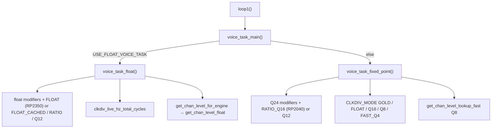

# DCO Engine Options (Float vs Fixed-Point)

This firmware can run the real-time voice engine in **float** or **fixed-point** form. The goal
is **maximum real-time speed without losing pitch / amplitude precision**. Which path you get
depends on compile-time flags in [`settings.h`](../settings.h).

**Complete flag catalog** (engine + noise + profiler + board IO + ADSR/LFO/lib):
[`BUILD_FLAGS.md`](BUILD_FLAGS.md).

**Live source of truth for engine flags:** [`settings.h`](../settings.h) — **pitch mode ids**,
**clkdiv mode ids**, **board defaults** (including `PITCH_INTERP_MODE`), **overrides**,
**guards**, then noise / profiling / board IO. [`DCO6.ino`](../DCO6.ino) includes it near the
top under the `SETTINGS FILE !!!! CRITICAL` banner and holds **no engine flags of its own**.

There is **no** `USE_FLOAT_ENGINE` umbrella; voice and amp are separate compile flags. Pitch
A/B overrides use `#undef PITCH_INTERP_MODE` then `#define` (the default is already set by the
board-defaults block).

---

## 1. Purpose and MCU guidance

| Target | Board defaults (`PICO_RP2350` / else) | Why |
|--------|--------------------------------------|-----|
| **RP2350** | `USE_FLOAT_VOICE_TASK` + `USE_FLOAT_AMP_COMP` + `USE_FLOAT_CV_OUTS` + `USE_MOD_MATRIX_FLOAT_ENGINE`; `PITCH_INTERP_FLOAT` (0); amp method **`LUT` (1)**; `CLKDIV_FLOAT` | FPU: float voice + float amp dual-build; `FLOAT` is *"much faster than cached"* on this core |
| **RP2040** (no FPU) | No float voice/amp/CV flags; `PITCH_INTERP_RATIO_Q16` (1); amp method `FIXED` (2); `CLKDIV_Q16` | Soft-float is expensive; lean Q8 amp; **fixed** `update_CV_outs` — soft-float would choke Core 1 |

Overrides (after board defaults) can `#undef` / `#define` those flags. See the commented
examples in the **ENGINE — overrides** block of `settings.h`.

---

## 2. Quick-pick flag sets

Normally **do nothing** — board defaults apply. To force behaviour, use the **ENGINE —
overrides** block in `settings.h`.

| Goal | What to set (overrides) |
|------|-------------------------|
| **Stock** | Leave overrides commented — RP2350 float + `FLOAT` + `LUT`; RP2040 fixed + `RATIO_Q16` + `FIXED` |
| **Float voice A/B** | `#define USE_FLOAT_VOICE_TASK` (FPU preferred) |
| **Float amp A/B** | `#define USE_FLOAT_AMP_COMP` (large LUT RAM; pick method via `AMP_COMP_METHOD_DEFAULT` / cmds 20–22) |
| **Float CV outs A/B** | `#define USE_FLOAT_CV_OUTS` (soft-float tax on RP2040; expect worse Core 1) |
| **Speed clkdiv (fixed voice)** | `#define CLKDIV_MODE CLKDIV_FAST_Q4` or `CLKDIV_Q8`; `CLKDIV_GOLD` / `CLKDIV_FLOAT` for A/B |
| **Pitch interp A/B** | `#undef PITCH_INTERP_MODE` then `#define PITCH_INTERP_MODE PITCH_INTERP_FLOAT` / `FLOAT_CACHED` / `RATIO_Q16` / `Q12` |

After changing flags: clean rebuild, confirm LittleFS amp-comp tables still load, listen to low
notes and amp plateau behaviour.

---

## 3. Engine flags

`settings.h` layout:

```text
ENGINE — pitch mode ids     // FLOAT / RATIO_Q16 / Q12 / FLOAT_CACHED
ENGINE — clkdiv mode ids    // GOLD / FLOAT / Q16 / Q8 / FAST_Q4
ENGINE — board defaults     // per-MCU: voice/amp/pitch/clkdiv/amp-method/CV/matrix
ENGINE — overrides          // #undef / #define to force (pitch needs #undef first)
ENGINE — guards             // FLOAT / FLOAT_CACHED require float voice; CLKDIV_MODE <= 4
ENGINE — noise              // NOISE_ENGINE
BOARD / IO                  // link flags, DMA, CV, reset polarity
CALIBRATION                 // PW sweep / polarity / amp duty targets
PRESETS / SRAM
```

| Define | Effect |
|--------|--------|
| `USE_FLOAT_VOICE_TASK` | Compiles `voice_task_float()`; omits fixed `voice_task_fixed_point()`. Float portamento in `voices.h`. **Default on RP2350**, off RP2040. |
| `PITCH_INTERP_MODE` | Pitch table path (ids in §4). Board default: **`FLOAT` (0) on RP2350**, **`RATIO_Q16` (1) on RP2040**. |
| `USE_FLOAT_AMP_COMP` | **Compile-time** float amp dual-build: Hz tables, LUT (`NUM_OSCILLATORS × 7001 × 2` bytes; ~109 KB at 8 osc), float precompute + Q8 seed. Not the same as method (§7). **Default on RP2350**, off RP2040. |
| `USE_FLOAT_CV_OUTS` | Float VCA/VCF/keytrack/drift/velocity math in `update_CV_outs`. Off → Q15/integer path. **Default on RP2350, off on RP2040** (soft-float would reintroduce `__aeabi_*` into the ~10 kHz path). |
| `USE_MOD_MATRIX_FLOAT_ENGINE` | Float mod-matrix evaluation. **Default on RP2350**, off RP2040. |
| `AMP_COMP_METHOD_DEFAULT` | Live method when float amp is built: `0 FLOAT_QUAD` / `1 LUT` / `2 FIXED` (runtime cmds 20–22). Board default: **`1 LUT` on RP2350**, **`2 FIXED` on RP2040**. |
| `CLKDIV_MODE` | Clkdiv, accuracy order: `0` GOLD (double `llround`); `1` FLOAT; `2` Q16 (shipping on RP2040); `3` Q8; `4` FAST_Q4. **Value `0` is GOLD, not the old HP0 Q4 path** (that is `FAST_Q4` = 4). **Value `1` is FLOAT, not the old PRECISE_Q8 path** (Q8 is 3). Board default **`Q16` on RP2040**, **`FLOAT` on RP2350**. |
| `UPDATE_CLK_DIV_INSTANTLY` | **On in tree.** Instant PIO divider update — removes note-transition clicks, but adds clkdiv delays and jitter when modulation is very fast. |
| `NOTE_RETRIG_MODE_DEFAULT` | `0` = EXACT_Y (Y load + phase hold), `1` = SYNC_JMP (restart jmp only; degree offsets need EXACT_Y). Runtime cmds 26/27. Default `0`. |
| `USE_VOICE_TASK_Q24` | Experimental Q24 voice task. **Commented out.** |
| `NOISE_ENGINE` | Which `DCO_Noise` class `noise0..1` use: `0` ColoredNoise, `1` FastNoiseGen, **`2` PrimeHybridNoise (in tree)**, `3` ProNoise32. |

**Voice vs amp:** independent. Float voice with `#undef USE_FLOAT_AMP_COMP` uses lean Q8 amp via
`get_chan_level_for_engine`. Fixed voice with float amp is unusual (extra RAM).

**CV outs:** independent of voice/amp. Bench banner prints `cv=FLOAT|FIXED`.

### Dispatch

```text
loop1() → voice_task_main()
            ├─ USE_FLOAT_VOICE_TASK → voice_task_float()
            └─ else                 → voice_task_fixed_point()
```



> `loop1()` reaches `voice_task_main()` only when **not** calibrating. The calibration trap at
> the top of `loop1()` calls `autotune_loop_task()` and returns early, so the voice task never
> runs while `calibrationFlag || calibrationVerifyRequested` is set.

Related (not engine math, but often used together):

| Define | State in tree | Role |
|--------|---------------|------|
| `BENCHMARKING_ENABLED` | **on** | Master gate for the whole bench block |
| `ENABLE_SWD_TELEMETRY` | **on** | SWD telemetry for PlotJuggler; defines `ENABLE_SWD_PERIOD` |
| `RUNNING_AVERAGE` | **off (commented)** | Cycle-accurate hot-path profiler (`bench.h`) |
| `RUNNING_AVERAGE_FINE` | off | Adds probes on the smallest stages; needs `RUNNING_AVERAGE` |
| `RUNNING_AVERAGE_PERIOD` | **unreachable** | Sits inside the `#elif defined(RUNNING_AVERAGE)` branch, which the SWD branch wins — see below |
| `ENABLE_MEM_DIAG` | **off + unreachable** | Same dead branch; cmd 13 RAM dump |
| `BENCH_STAGE_STRIDE` | `1` | Stage probes every Nth loop; note-on always. *(The comment says "default 9"; the actual `#define` is 1.)* |
| `BENCH_USE_SYSTICK` | `1` | SysTick for PERIOD + stages; `0` = 1 µs timer for all probes |
| `BENCH_PERIOD_MAX_US` | `20000` | Discard PERIOD samples longer than this |
| `BENCH_PATH_STATS` | off | All path bumps + `-- Path counters --` dump |
| `AMP_COMP_BENCHMARK` | off | Amp cmds 24–25; implies `USE_FLOAT_AMP_COMP` |
| `DCO_DEBUG_REPORT` | `0` in `voices.ino` | Serial dump of OSC1 frequency stages |
| `ENABLE_FS_CALIBRATION` | on in `globals.h` | Load LittleFS voiceTables / PW cal into amp-comp arrays |
| `SRAM_HOT_ENABLE` / `SRAM_DATA_ENABLE` | `1` | Move hot code / data into SRAM |

> ⚠️ **The profiler selection is an `#if` / `#elif` chain and the second branch is currently
> dead.** `ENABLE_SWD_TELEMETRY` is defined, so `#if defined(ENABLE_SWD_TELEMETRY)` wins and
> everything inside `#elif defined(RUNNING_AVERAGE)` — including `RUNNING_AVERAGE_PERIOD` and
> `ENABLE_MEM_DIAG` — **never compiles**, regardless of the `#define` lines written there.
> To get the running-average profiler back you must comment out `ENABLE_SWD_TELEMETRY` **and**
> uncomment `RUNNING_AVERAGE`.

---

## 4. Pitch interpolation (`PITCH_INTERP_MODE`)

One compile-time enum selects **exactly one** interpolator and allocates **only that mode's**
slope / table storage. No runtime branch on the hot path. Live call sites use
**`interpolate_live_ratio_q16`** (fixed voice) / **`interpolate_live_ratio_f`** (float voice) —
`static inline` wrappers with `#if PITCH_INTERP_MODE` inside (not function pointers). Named
interpolators stay for cmds 28/29.

Defined in `settings.h`:

| Mode | Value | Hot-path function | Storage | Engine |
|------|-------|-------------------|---------|--------|
| `PITCH_INTERP_FLOAT` | 0 | `interpolateRatioFloat_fast` | `x/yMultiplierTableF`, `slopeF` | **RP2350 default**; float voice **required** |
| `PITCH_INTERP_RATIO_Q16` | 1 | `interpolateRatioQ16_fast` (trunc±1) | int `x/y` **native Q16**, **`slopeQ16`** | **RP2040 default**; float voice A/B |
| `PITCH_INTERP_Q12` | 2 | `interpolatePitchMultiplierIntQ16_cached` + reciprocal | int tables ×10000, `slopeQ12` | Slope A/B only |
| `PITCH_INTERP_FLOAT_CACHED` | 3 | `interpolateRatioFloat_cached_fast` (trunc+clamp±1, `noinline`) | same float tables as `FLOAT` | Float voice required; walk A/B |

> **Renamed:** id 3 was `PITCH_INTERP_FLOAT_FAST` in earlier revisions. It is now
> **`PITCH_INTERP_FLOAT_CACHED`**, and it is **no longer the RP2350 default** — the comment on
> `PITCH_INTERP_FLOAT` in `settings.h` reads *"default for rp2350, much faster than cached"*.
> Earlier versions of this page recommended the opposite.

There is **no** selectable `PITCH_INTERP_Q20` or `PITCH_INTERP_Q8`. Live `RATIO_Q16` uses
**Q16 slopes** (32-bit lerp when the stock table fits). Accuracy bench cmd 29 may still use a
private higher-res reference.

**Defaults** (set inside each MCU branch in **ENGINE — board defaults**, `#ifndef`):

| Board | Default mode |
|--------|----------------|
| `PICO_RP2350` | `PITCH_INTERP_FLOAT` (0) |
| else (RP2040 / fallback) | `PITCH_INTERP_RATIO_Q16` (1) |

**Guards:** `FLOAT` / `FLOAT_CACHED` without float voice → `#error`. `CLKDIV_MODE > 4` →
`#error`. Float voice may use any mode via **`interpolate_live_ratio_f`** (fixed interpolators
convert scaled `float x → Q16` then back to a float ratio for A/B).

**Float domain (`FLOAT` / `FLOAT_CACHED`):** tables store natural modifier `x ∈ [-1, 3]` and
frequency ratio `y` directly. Call site passes `freqModifiers` with **no** `×10000`; the
interpolator returns the ratio (no `/scale`). Same storage for both; only the segment find
differs. The scale exists only for int tables.

**Fixed-voice flow** (`!USE_FLOAT_VOICE_TASK`):

1. Portamento → current frequency in **Q24 Hz** (`Hz × 2^24`).
2. Sum pitch modifiers in **Q24** (pitch bend, LFO, unison, ADSR→detune, drift, matrix,
   epsilon ≈ 1.00001).
3. **`modifiers_q24_to_xQ16`:** `RATIO_Q16` = `trunc(modifiers_q24 / 2^8)` (native domain;
   **no** ×10000). **`Q12` only:** scale × `multiplierTableScale` (10000) into legacy
   table-units Q16.
4. **`interpolate_live_ratio_q16`** → **ratio Q16** (`RATIO_Q16` table `y` is already a
   frequency ratio; `Q12` returns table `y` then reciprocal-multiply ÷10000).
5. `freq_q24 = (portamento_cur_freq_q24 * ratioQ16) >> 16` (OSC2/3 also fold detune into the
   Q16 factor).

| Mode | Slope / precision notes |
|------|-------------------------|
| `RATIO_Q16` | RP2040 production: native Q16 x/y, `slopeQ16` lerp, trunc±1 |
| `Q12` | Legacy ×10000 tables; return `y` then reciprocal |

Override examples (float voice): `#undef PITCH_INTERP_MODE` then
`#define PITCH_INTERP_MODE PITCH_INTERP_FLOAT_CACHED` or `PITCH_INTERP_RATIO_Q16`. Float
portamento / clkdiv stay float; only the table interpolator changes.

Speed/accuracy one-shots (private tables in `pitch_interp_bench.ino`): debug **28/29** with
`RUNNING_AVERAGE` — see [`BENCHMARKING.md`](BENCHMARKING.md) §9. Cmd **28** prints **seq** +
**jump** speed tables. `live_pitch=` in the header is the compiled `PITCH_INTERP_MODE`.

---

## 5. Fixed-point clock divider

Active in both voice engines via `CLKDIV_MODE` (board default **`CLKDIV_Q16`** on RP2040,
**`CLKDIV_FLOAT`** on RP2350). Override **`CLKDIV_FAST_Q4`** / **`CLKDIV_Q8`** for speed,
**`CLKDIV_GOLD`** / **`CLKDIV_FLOAT`** / **`CLKDIV_Q16`** for A/B.

| Value | Math | Notes |
|-------|------|-------|
| **0 GOLD** | Q24 → double Hz → `llround(sys / hz)` | Gold standard / A/B. Soft-double on M0+ and RP2350. |
| **1 FLOAT** | Q24 → float Hz → `fminf(sys/hz + 0.5)` | Same math as the float voice (`clkdiv_live_hz_total_cycles`). Soft-float on M0+. |
| **2 Q16** | Q16 Hz denom → 64/32: `freq_q16 = (freq_q24 + 1<<7) >> 8`, then `(sys<<16 + q16/2) / q16` | ±1/65536 Hz vs full Q24. Shipping on RP2040. |
| **3 Q8** | Q8 Hz; `q = sys/f_int` then remainder correction (two 32/32). `f_int < 16` falls back to internal `precise_q8` (64/32, not a `CLKDIV_MODE`). | Faster than Q16 on M0+; low-Hz tail ~3¢ @ ~1 Hz. |
| **4 FAST_Q4** | Round to **Q4 Hz** (`(freq_q24 + 1<<19) >> 20`), then 32-bit `(sys*16 + Q4/2) / Q4` | Fastest; ~**1 µs/voice**. This is the old HP0 path. |

Fixed `vt_clk_div` calls `clkdiv_live_total_cycles` (Q24; compile-time alias). Float
`vt_clk_div` calls `clkdiv_live_hz_total_cycles` (native Hz; FLOAT/GOLD stay Hz, else Hz→Q24
then the Q24 alias). All five then add a measured correction (currently 0) and
`pio_clk_div_for_y` (Y locked every frame). Note-on uses `pio_period_split` (can rewrite Y).

Speed/accuracy one-shots (debug **32/33**, `RUNNING_AVERAGE`): all methods on **both** voice
engines. Speed reported as **`pctVsGOLD_REF`**. See [`BENCHMARKING.md`](BENCHMARKING.md) §10.

---

## 6. Float engine pipeline

Active when `USE_FLOAT_VOICE_TASK` is defined.

| Stage | Behaviour |
|-------|-----------|
| Portamento | Separate float state in `voices.h` (`porta_*_f`): TIME = linear Hz; SLEW = linear semitones via `noteIndex_to_freqFloat` |
| Pitch bend / LFO / ADSR / drift | Computed in float; many depths still arrive as Q24 from core 0 / params and are scaled by `1/2^24` each frame |
| Multiplier table | Board default `interpolateRatioFloat_fast` (`FLOAT`). Override to `FLOAT_CACHED`, `RATIO_Q16` (native Q16), or `Q12` (×10000 glue). |
| Clkdiv | `clkdiv_live_hz_total_cycles` (`CLKDIV_MODE`; Q16/Q8/FAST_Q4 convert Hz→Q24), then OSR / phase math |
| Amp-comp | `get_chan_level_for_engine(freqHz, dco)` → `get_chan_level_float` when float amp-comp is on |
| PW | Float intermediates, then integer `get_PW_level_interpolated` (shared) |

**A/B:** under float voice, non-`FLOAT` modes keep the float voice shell and swap only the
interpolator. The float→Q16 convert tax is part of those candidates; native `FLOAT` stays
convert-free.

There are **no** additional float precision `#define`s beyond the voice/amp/CV/matrix flags and
`PITCH_INTERP_MODE`.

---

## 7. Amplitude compensation

Gated by **compile-time** `USE_FLOAT_AMP_COMP` (**default on RP2350**, off RP2040). That flag
**builds** the float amp stack; `AMP_COMP_METHOD_*` only **picks** among methods once the stack
is built.

Flash format is shared: frequencies stored as **`freq × 100`** (`freq_x100`). Runtime
representation diverges after `init_FS()`.

| Mode | After FS load | Precompute | Runtime lookup |
|------|---------------|------------|----------------|
| **Fixed** (`!USE_FLOAT_AMP_COMP`) | `ampCompFrequencyArray` in **Q8 Hz** (`FREQ_FRAC_BITS = 8`), `ampCompArray` as `int32_t` | `precomputeCoefficients()` — `FixedQuadWindow` with `T_FRAC = 12` | `get_chan_level_lookup_fast(xQ8, voiceN)` |
| **Float** (`USE_FLOAT_AMP_COMP`) | `ampCompFrequencyHz` as `float`, shared `ampCompArray` as `int32_t` | Float quadratic + dense LUT fill; also seeds Q8 and runs the fixed precompute for `FIXED` | Selected by `amp_comp_method` |

Shared constants: `ampCompTableSize = 22`, `AMP_COMP_MAX_HZ = 7000`, plateau metadata per
oscillator, shared `ampCompArray` (`int32_t`). Per-window coefficients are
`FixedQuadWindow fixedWin[][]` and `FloatQuadCoeffs floatCoeffs[][]`.

**Domain-max early-out:** float quadratic and FIXED both return `DIV_COUNTER` at
`freq >= AMP_COMP_MAX_HZ` / `x >= AMP_COMP_MAX_HZ_Q` (cal sentinel = full RANGE). Prevents a
window-scan miss at exact max from falling through to window 0.

**Plateau early-out:** float / LUT use `plateauStartIndex >= 0` plus `plateauStartFreqHz`.
FIXED (`get_chan_level_lookup_fast`) does **not** use the shared index after dual-build;
validity is `plateauStartFreqQ < AMP_COMP_MAX_HZ_Q`.

`precompute_amp_comp_for_engine()` runs the active precompute(s) at startup (from `setup1()`).
Under float amp-comp it also builds `ampCompLut[osc][0..7000]`
(`NUM_OSCILLATORS × 7001 × 2` bytes; ~109 KB at 8 osc) from `get_chan_level_float_quad` and
keeps fixed Q8 tables for A/B.

### Live methods (`USE_FLOAT_AMP_COMP`)

| Id | Name | Behaviour |
|----|------|-----------|
| 0 | `FLOAT_QUAD` | Cached walk + `y = (a*x+b)*x+c` (needs `USE_FLOAT_AMP_COMP`) |
| 1 | `LUT` | Nearest Hz → `ampCompLut` index. **RP2350 default.** Needs float amp |
| 2 | `FIXED` | Q8 `get_chan_level_lookup_fast`. **RP2040 default**; the only path without float amp |

- **Compile-time default:** board defaults in [`settings.h`](../settings.h) —
  **RP2350 → `LUT` (1)**, **RP2040 → `FIXED` (2)**. Override with
  `#define AMP_COMP_METHOD_DEFAULT` in **ENGINE — overrides** (ids 0/1 need
  `USE_FLOAT_AMP_COMP`).
- **Runtime:** `PARAM_DEBUG_COMMAND` (160) values **20–22** (`amp_comp_set_method`). Profiler
  dump (10) appends `amp_comp method=…`.
- **Facade:** `get_chan_level_for_engine` / `get_chan_level_float` dispatch on
  `amp_comp_method`. Fixed voice: `amp_level_q24` / `amp_chan_levels_fixed` — shipping stays
  Q24→Q8→`lookup_fast`; with `USE_FLOAT_AMP_COMP`, non-FIXED methods use Q24→Hz then
  `get_chan_level_by_method`.
- **Speed order:** on RP2350 (FPU) typically **LUT ≪ FLOAT_QUAD ≲ FIXED** — which is why the
  board default is LUT. On RP2040 soft-float, FLOAT_QUAD is usually slowest.
  See [`BENCHMARKING.md`](BENCHMARKING.md) §8.

Without `USE_FLOAT_AMP_COMP`, only FIXED exists; method selects collapse to FIXED.

`voice_task_float` and autotune both use `get_chan_level_for_engine`.

### Hardware polarity and duty targets

Set in the **CALIBRATION** block of `settings.h`, not in the amp-comp code:

```c
#define AMP_DUTY_INVERT_ALL   false
#define AMP_DUTY_INVERT_OSC_A true
#define AMP_DUTY_INVERT_OSC_B true

#define AMP_TARGET_DUTY_OSC_A 0.50f
#define AMP_TARGET_DUTY_OSC_B 0.62f
```

The invert flags reverse the **search direction** of the duty bisection (measured duty moves
the opposite way on this hardware); they are not an output inversion. Osc B does **not** target
50 %.

Speed/accuracy one-shots: `#define AMP_COMP_BENCHMARK` + `RUNNING_AVERAGE`, debug **24/25** —
see [`BENCHMARKING.md`](BENCHMARKING.md) §8.

---

## 8. Formats cheat-sheet

| Format | Representation | Typical use |
|--------|----------------|-------------|
| float Hz | `float` | Float voice path; float amp-comp; `sNotePitches[]` |
| Q24 Hz | `int64_t` / `int32_t`, `Hz × 2^24` | Fixed portamento / final freq; LFO/ADSR/pitchbend depths |
| Q16 semitone | `int32_t`, note × `2^16` | Fixed slew portamento |
| Q16 table / ratio | `int32_t` | Pitch table `x` and frequency ratio (`RATIO_Q16` native; `Q12` after `/10000`) |
| Q4 Hz | `uint32_t`, `Hz × 16` | Fast fixed clkdiv (`CLKDIV_FAST_Q4`) |
| Q16 Hz | `uint32_t`, `Hz × 65536` | Fixed clkdiv denom (`CLKDIV_Q16`) |
| Q8 Hz | `int32_t`, `Hz × 256` | Fixed amp-comp frequency domain; Q8 clkdiv denom |
| Q12 `t` | `T_FRAC = 12` | Fixed amp-comp quadratic parameter |
| Q16 / Q12 slopes | `slopeQ16` (live RATIO) / `slopeQ12` (Q12 A/B) | Multiplier table interpolation |
| Q28 reciprocal | `FixedQuadWindow.invDx_q28` | Fixed amp-comp `1/dx` |
| `freq_x100` | `int32_t` | FS / calibration storage |
| Table scale | `multiplierTableScale = 10000` | Int pitch tables only (`FLOAT` is unscaled) |

System clock used by clkdiv: `sysClock_Hz`, cached from `clock_get_hz(clk_sys)` by
`sys_clock_hz_refresh()` (`globals.h`), called once per core at the top of `setup()` and
`setup1()`. Arduino sets `clk_sys` and `F_CPU` before either runs; `clock_get_hz` is not free,
so it must never appear on the voice hot path.

---

## 9. Shared behaviour (both engines)

- **LFO pitch mods:** Core 0 writes `lfo1_pitch_mod_q24[]` / `lfo2_pitch_mod_q24[]` every
  ~50 µs; Core 1 reads the volatiles in the voice task (float path converts each frame).
- **PW PWM:** both engines end in `get_PW_level_interpolated` (integer map using calibrated
  center/limits). Sweep mode is a compile-time template parameter, not a runtime branch.
- **Autotune:** `voice_task_autotune()` uses float-style clkdiv math and
  `get_chan_level_for_engine`; it is compiled regardless of engine and is not the production
  note path.
- **Bus priority:** `setup1()` ends with
  `bus_ctrl_hw->priority = BUSCTRL_BUS_PRIORITY_PROC1_BITS`, giving the audio core priority.
- **Legacy helpers:** `voice_task_simple()` / `voice_task_debug()` / gold reference are
  **removed**.

---

## 10. Known traps

1. Voice / amp / pitch / clkdiv / amp-method defaults are set **inside** each MCU branch in
   board defaults; force changes in **overrides** (`#undef` then `#define` when replacing a
   default).
2. Under float voice, `RATIO_Q16` / `Q12` are valid A/B overrides; they allocate int tables
   (not `slopeF`).
3. Only the active mode's slope array is allocated — no inert `slopeQ12` RAM on the float /
   `RATIO_Q16` defaults.
4. `USE_FLOAT_AMP_COMP` without the float methods you need still costs LUT RAM; `#undef` it for
   a lean Q8-only amp.
5. Docs mentioning `USE_FLOAT_ENGINE` / `PITCH_USE_RATIO_Q16` / `PITCH_INTERP_USE_Q*` are
   obsolete.
6. Stale "Q18 frequency" / `T_FRAC is 14` remarks exist in places — trust `T_FRAC = 12` in
   `amp_comp.h`.

### Stale labels still in the code

These are **source** inconsistencies, not doc errors. Expect confusing output until fixed:

| Location | Problem |
|---|---|
| `bench.h` | Prints the label `"FLOAT_FAST"` for the `PITCH_INTERP_FLOAT_CACHED` branch — a mode name that no longer exists |
| `settings.h` guards | `#error` text says *"PITCH_INTERP_FLOAT / FLOAT_FAST require USE_FLOAT_VOICE_TASK"* — should read `FLOAT_CACHED` |
| `settings.h` overrides | The `PITCH_INTERP_RATIO_Q16` override line is commented *"shipping default both MCUs"*, but RP2350's board default is `PITCH_INTERP_FLOAT` |
| `settings.h` calibration | `PW_SWEEP_MODE_DEFAULT` is set to `0` by the `PROJECT_INSTRUMENT == 4` block and then **redefined to `1`** with its `#undef` still commented out — a redefinition warning with an ambiguous final value |

---

## 11. Change checklist

1. Prefer **ENGINE — overrides** in `settings.h`; leave board defaults alone unless changing
   MCU policy.
2. Full rebuild (both cores / clean if the IDE caches oddly).
3. Confirm the `ENABLE_FS_CALIBRATION` load path matches the amp-comp mode (no assert / empty
   tables).
4. Play low and high notes; check for zippering, beating, or amp dropouts at the plateau.
5. Optional: enable `RUNNING_AVERAGE`, send debug command 10, and compare the `%win` budget
   before and after the change ([`BENCHMARKING.md`](BENCHMARKING.md)).

---

## 12. Where the code lives

| Concern | Files |
|---------|-------|
| Flag definitions | [`settings.h`](../settings.h) |
| Dispatch + both voice tasks | `voices.ino` / `voices.h` |
| Amp-comp dual path | `_shared/amp_comp.h`, `FS.ino` |
| Note tables | `_shared/noteList.h` (`sNotePitches`, `sNotePitches_q24`) |
| Clock cache | `globals.h` (`sys_clock_hz_refresh`, `sysClock_Hz`) |
| Loop call site | [`DCO6.ino`](../DCO6.ino) `loop1()` → `voice_task_main()` |
