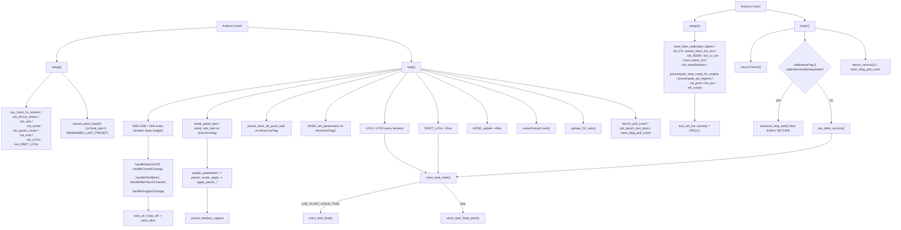

# DCO6 File Index

Purpose of **every file**, and for each source function: **what it does**, **who calls it**, and
**when**.

> **Shared headers.** `params_def.h`, `param_router.h`, `param_meta.h`,
> `serial_input_protocol.h`, `serial_param_protocol.h`, `serial_frame.h`, `serial_parser.h` and
> `serial_dma_tx.h` are **not** files in this folder. They come from the shared
> [`DCO-PROTOCOL`](../../DCO-PROTOCOL/README.md) library, symlinked in as
> `_build_libs/DCO-PROTOCOL`. Likewise `amp_comp.h`, `noteList.h`, `utils.h`, `voices.h`,
> `FS.h`, `autotune*.h`, `mcu_board.h`, `midi*.h`, `cv_*.h`, `character_jitter.h`, `clkdiv.h`,
> `noise.h`, `wave_mux.h`, `bench.h`, `mem_diag.h`, `PWM.h`, `memory_port.h` and
> `mod_matrix_engine.h` come from **DCO-SHARED-LIBRARIES** as `_shared/…`. Edit them in the
> library, once, for every board.

- Deep narrative: [`REFERENCE_AI.md`](REFERENCE_AI.md)
- Build flags catalog: [`BUILD_FLAGS.md`](BUILD_FLAGS.md)
- Engine float/fixed math: [`ENGINE_OPTIONS.md`](ENGINE_OPTIONS.md)
- Serial & params: [`README_serial_and_params.md`](README_serial_and_params.md)
- Preset store / cal dump protocol: [`PRESET_STORE.md`](PRESET_STORE.md)
- Calibration banks on flash: [`../_shared/docs/CALIBRATION_STORAGE.md`](../_shared/docs/CALIBRATION_STORAGE.md)
- Hot-path profiling: [`BENCHMARKING.md`](BENCHMARKING.md)
- SRAM / heap / stack: [`MEMORY.md`](MEMORY.md)
- Pin map: [`PINOUT.md`](PINOUT.md)
- Repo entry / doc index: [`../README.md`](../README.md)

Headers with no bodies are marked **no function definitions**.
**Dead** = no live callers. **Unreachable** = call site exists but cannot run as currently
gated. **`#if 0`** = compiled out.

---

## Call-flow overview

> **Two corrections vs earlier revisions of this page.**
> 1. `ADSR_update()` runs on **Core 0**, not Core 1.
> 2. The calibration branch is a **single** `autotune_loop_task()` with an early return, not an
>    auto/manual fork. `DCO_calibration()` and `DCO_calibration_debug()` are called *inside*
>    it. The gate also tests `calibrationVerifyRequested`.

| Context tag | Meaning |
|-------------|---------|
| Framework | Arduino invokes `setup` / `loop` / `setup1` / `loop1` |
| Boot Core0 / Core1 | Inside `setup` / `setup1` |
| Every loop0 | Runs on every Core 0 iteration |
| 1 ms / 5 ms / ~49 µs / ~51 µs | Gated by a `microsTimer` flag on Core 0 |
| Voice task | Core 1 hot path, per oscillator per frame |
| Serial RX | Called by the parser from a `SerialCommandDef` row |
| Param table | Reached through `paramTable[]` → jump table |
| MIDI CB | MIDI library callback |
| Calibration | Only while `calibrationFlag` / `calibrationVerifyRequested` |
| Bench | Only with `RUNNING_AVERAGE` / bench debug commands |

---

## Sketch files

### `DCO6.ino` — **4 functions**

Top-level sketch. Includes `project_config.h` and `settings.h` first (engine flags), then the
shared protocol and `_shared/` headers in a **fixed order** annotated in the file
(amp-comp and autotune must precede `bench.h`).

| Function | What it does | Called from | When |
|---|---|---|---|
| `setup()` | Core 0 boot: clock cache, timers, USB, serial, param router, MIDI, LFOs, preset recall, cal pin | Framework | Boot Core0 |
| `setup1()` | Core 1 boot: cal tables, FS, preset RAM, ADSR, CV, matrix, wave mux, amp-comp precompute, PW regions, PWM, PIO, voices, bus priority | Framework | Boot Core1 |
| `loop()` | Core 0 forever loop (see call-flow) | Framework | Every loop0 |
| `loop1()` | Core 1 forever loop: calibration trap → `pio_defer_service` → `voice_task_main` | Framework | Every loop1 |

### `settings.h` — no function definitions

**The engine flag file.** Pitch mode ids, clkdiv mode ids, per-board defaults, overrides,
guards, noise engine, board/IO flags, calibration defaults, preset options, SRAM placement.
This is the live source of truth for engine configuration — *not* the sketch.
See [`ENGINE_OPTIONS.md`](ENGINE_OPTIONS.md).

### `project_config.h` — no function definitions

Single declaration of `PROJECT_INSTRUMENT` (**4**) and `DCO_MCU_BOARD`. Read through a symlink
by the shared submodules so they discover which instrument they belong to.

### `globals.h` — no function definitions (one inline)

Voice/oscillator counts, pin arrays per `DCO_MCU_BOARD`, PIO/SM mapping, PWM slice arrays,
cal pin, `pioPulseLength`, PIO timing constants, clock cache.

| Function | What it does | Called from | When |
|---|---|---|---|
| `sys_clock_hz_refresh()` | Caches `clock_get_hz(clk_sys)` into `sysClock_Hz_cached` (+ float) | `setup()`, `setup1()` | Boot, once per core |

### `include_all.h` — no function definitions
Aggregate include used by `Serial.ino`.

---

### `Serial.ino` — **38 functions**

**Ingress / gating**

| Function | What it does | Called from | When |
|---|---|---|---|
| `init_serial()` | Raw `uart0` DIN MIDI @31250 + IRQ, `Serial2` @2.5 M (FIFO 2048, DMA TX), builds both command LUTs | `setup()` | Boot Core0 |
| `init_usb()` | TinyUSB + USB MIDI + `Serial.begin(2000000)` | `setup()` | Boot Core0 |
| `serial_panel_task()` | Sets `g_param_ingress = PARAM_SRC_MAINBOARD`, drains `Serial2` through the parser | `loop()` | 1 ms, when `Serial2.available()` |
| `serial_usb_task()` | Sets `PARAM_SRC_USB`, drains USB CDC | `loop()` | 1 ms, `ENABLE_USB_CONTROL` |
| `serial_forward_usb_edit_to_mb()` | Re-emits a block to the Mainboard **only** if ingress is USB | `dco_rx_handle_adsr1/2/3`, `..._filter_block` | Serial RX |
| `dco_should_forward_usb_param()` | Predicate for mirroring a `'p'` back out | `dco_rx_handle_param16` | Serial RX |

**RX handlers** (registered in the command tables)

`dco_rx_handle_param16` · `dco_rx_handle_adsr1` · `dco_rx_handle_adsr2` · `dco_rx_handle_adsr3`
· `dco_rx_handle_filter_block` · `dco_rx_handle_preset_name` · `dco_rx_handle_preset_dir_request`
· `dco_rx_handle_screen_signal` · `dco_rx_handle_bulk_chunk` · `dco_rx_handle_bulk_commit` ·
`mb_handle_mod_stream` · `mb_handle_bench_text`

All are called **only** by `serial_parser_drain()` via their `SerialCommandDef` row. Which
transport can reach each one is decided by table membership — see
[`README_serial_and_params.md`](README_serial_and_params.md).

**TX helpers**

| Group | Functions | Emits |
|---|---|---|
| Notes / expression | `serial_send_note_on`, `serial_send_note_off`, `serial_send_expression` | `'n'` `'o'` `'e'` |
| Params | `serialSendParam16`, `serialSendParam32`, `serial_echo_usb_param16` | `'p'` `'x'` |
| Blocks | `serial_send_adsr_block_to_mb` (helper), `..._vca_`, `..._vcf_`, `..._dco_`, `serial_send_filter_block_to_mb` | `'a'` `'b'` `'c'` `'d'` |
| Presets | `serial_send_preset_loaded_to_mb`, `serial_send_preset_scroll_to_mb` | `'L'`, scroll |
| Screen | `serial_send_screen_signal_to_mb` | `'s'` |
| Patch bursts | `serial_send_patch_osc/lfo/mod/mix_block_to_mb`, `serial_send_preset_burst_to_mb` | `'v'` `'l'` `'M'` `'Q'` |
| Bench | `mb_bench_text_drain` | drains queued `'t'` text on Core 0 |

### `Serial.h` — no function definitions
Includes the five shared protocol headers, declares `Serial2Dma` and every TX helper above.

---

### `params.ino` — **99 functions**

The largest file. Structure:

1. **~90 `apply_param_*` appliers** — one per routed ParamId. Each is a small setter, most
   marked `SRAM_HOT`. Called **only** through the jump table.
2. `paramTable[]` — the descriptor array.
3. `is_calibration_parameter()` — the 10-id allow-list used while calibrating.
4. `init_param_router()` — builds `dcoParamJump[256]` from `paramTable[]`.
5. `update_parameters()` — gating + dispatch + `preset_shadow_capture`.
6. Preset shadow appliers.

| Function | What it does | Called from | When |
|---|---|---|---|
| `init_param_router()` | `param_router_build_jump(dcoParamJump, paramTable, …)` | `setup()` | Boot Core0 |
| `update_parameters()` | Calibration gating, then `param_router_apply`, then shadow capture | `dco_rx_handle_param16`, `midi_cc_apply`, preset recall | Serial RX / MIDI CB / recall |
| `is_calibration_parameter()` | True for ids 150–153, 156, 158, 159, 160, 161, 162 | `update_parameters` | Calibration |
| `apply_param_*` (×~90) | Individual setters | Jump table only | Param table |
| `dco_apply_preset_shadow()` | Pushes the RAM shadow into live globals | Preset recall | Recall |
| `dco_preset_assign_state()` / `dco_preset_prebake()` | Build / bake record state | `preset_record_build` | Save |
| `dco_send_all_calibration_data()` | Bulk cal telemetry out | `apply_param_cal_dump` | Debug cmd |
| `bake_drift_lfo_frequencies()` | Recomputes drift LFO rates | `apply_param_analog_drift_speed` | Param table |

### `voices.ino` — **31 functions**

Voice engine, pitch tables, portamento, amp glue.

| Function | What it does | Called from | When |
|---|---|---|---|
| `voice_task_main()` | Dispatch: float vs fixed voice task | `loop1()` | Every loop1 (not calibrating) |
| `voice_task_float()` | Float voice engine | `voice_task_main` | `USE_FLOAT_VOICE_TASK` |
| `init_voices()` | Voice state + multiplier tables | `setup1()` | Boot Core1 |
| `initMultiplierTables()` | Builds the pitch tables for the compiled mode | `init_voices` | Boot Core1 |
| `interpolate_live_ratio_f()` / `_q16()` | `static inline` wrappers with `#if PITCH_INTERP_MODE` inside — **the live call sites** | Voice task | Voice task |
| `interpolateRatioFloat_fast()` | `PITCH_INTERP_FLOAT` (0) — **RP2350 default** | wrapper | Voice task |
| `interpolateRatioQ16_fast()` | `PITCH_INTERP_RATIO_Q16` (1) — **RP2040 default** | wrapper | Voice task |
| `interpolateRatioFloat_cached_fast()` | `PITCH_INTERP_FLOAT_CACHED` (3) | wrapper | Voice task |
| `interpolatePitchMultiplierIntQ16_cached()` | `PITCH_INTERP_Q12` (2) | wrapper | Voice task |
| `modifiers_q24_to_xQ16()` | Q24 modifier sum → table domain | Fixed voice task | Voice task |
| `porta_setup_time_f/_q16`, `porta_setup_slew_f/_q16`, `porta_setup_glide_f/_q16`, `porta_latch_endpoints_f/_q16`, `porta_resolve_start_note_f/_q16` | Portamento, float and fixed variants | `note_on`, voice task | Note-on / voice task |
| `get_osc_clk_div()` / `update_osc_clk_div_instantly()` | Clkdiv for an oscillator; the second is gated by `UPDATE_CLK_DIV_INSTANTLY` | Voice task | Voice task |
| `amp_level_q24()` / `amp_chan_levels_fixed()` | Fixed amp-comp glue | Fixed voice task | Voice task |
| `setSyncMode()` | Applies sync mode, triggers SM remap | `apply_param_sync_mode` | Param table |
| `noteIndex_to_freqFloat`, `freqFloat_to_noteIndex`, `noteQ16_to_freqQ24`, `float_to_q24`, `q24_to_float` | Conversion helpers | Various | — |

### `voice_task_backup.ino` — **2 functions** ⚠️ **NOT a backup**

Despite the filename this is **live production code**, guarded by `#ifndef USE_FLOAT_VOICE_TASK`.

| Function | What it does | Called from | When |
|---|---|---|---|
| `voice_task_fixed_point()` | **The fixed-point voice engine** — the shipping path on RP2040 | `voice_task_main` | When float voice is not compiled |
| `voice_task_Q24()` | Experimental Q24 engine | — | `#ifdef USE_VOICE_TASK_Q24` (off) → **compiled out** |

🛠️ Suggested rename: `voice_task_fixed.ino`. The current name invites someone to delete the
RP2040 engine.

### `state_machines.ino` — **21 functions**

PIO programs, SM assignment, deferred PIO work.

| Function | What it does | Called from | When |
|---|---|---|---|
| `init_pio()` | Loads programs, configures all SMs | `setup1()` | Boot Core1 |
| `dco_triangle_init()` | Triangle core init (Osc B / odd idx); **side-set pins only** | `init_pio` | Boot Core1 |
| `assign_sm_mapping()` | Rewrites `VOICE_TO_SM[]` when `syncMode` changes | `setSyncMode` | Param table |
| `pair_master()` / `pair_slave()` | Which osc of a pair leads | sync logic | Voice task |
| `ensure_soft_sync_program()` | Loads the soft-sync program on demand | sync logic | Param table |
| `pio_defer_request_*` (5) | Queue work for Core 1: `_cal_restore`, `_period_probe`, `_reset_pulse_all`, `_subosc`, `_sync_mode` | Param appliers, Core 0 | Any time |
| `pio_defer_service()` | Drains the deferred queue | `loop1()` | Every loop1 (not calibrating) |
| `pio_reset_pin_apply_polarity()` | Applies `GPIO_OVERRIDE_INVERT` when `ENABLE_PIO_RESET_INVERT` | `init_pio` | Boot Core1 |
| `start_voice_sms()` | Enables the state machines | `init_pio` | Boot Core1 |
| `osc_reload_reset_pulse_all()` | Re-arms the reset pulse width | deferred | Debug cmd 160 |
| `set_subosc_divide()` | Sub-osc divider | deferred | Param table |
| `pio_period_probe()` / `_run()` / `pio_solve_period_model()` / `pio_probe_report_flush()` | Period measurement and reporting | deferred / bench | Bench |
| `pio_topology_report()` | Prints the voice→PIO→SM map (**1-based** oscillator numbering) | Debug cmd | Bench |

### `midi.ino` — **22 functions**

| Function | What it does | Called from | When |
|---|---|---|---|
| `init_midi()` | Binds callbacks, opens MIDI ports | `setup()` | Boot Core0 |
| `on_midi_uart_rx()` | **UART0 exclusive IRQ** — pushes DIN bytes into the lock-free SRAM ring | Hardware IRQ | Any time |
| `handleNoteOn/Off`, `handleControlChange`, `handlePitchBend`, `handleAfterTouchChannel`, `handleProgramChange` | MIDI library callbacks | `MIDI_*.read()` | Every loop0 |
| `note_on()` / `note_off()` | Allocate/release, drive `'n'`/`'o'` out | handlers, `user_key_task` | MIDI CB |
| `voice_alloc()` | Allocation policy (RR / oldest / quietest) | `note_on` | MIDI CB |
| `voice_mark_on/off/regate` | Voice bookkeeping | `voice_alloc` | MIDI CB |
| `mono_note_stack_clear()`, `all_notes_off()` | Panic / mode change | `setVoiceMode`, CC 123 | MIDI CB |
| `setVoiceMode()` | mono (0) / poly (1) / stack (2) | `apply_param_voice_mode` | Param table |
| `midi_cc_apply()` / `midi_cc_handle()` | CC → block globals or `update_parameters` | `handleControlChange` | MIDI CB |
| `get_osc2_from_osc1()`, `get_modified_indices()`, `fold_table_idx()` | Helpers | Various | — |

### `adsr.ino` — **26 functions**

| Function | What it does | Called from | When |
|---|---|---|---|
| `init_ADSR()` | Builds the three envelope objects | `setup1()` | Boot Core1 |
| `ADSR_update()` | Advances all envelopes | `loop()` | **Core 0**, ~49 µs |
| `ADSR_set_parameters()` | Pushes staged A/D/S/R into the objects | `loop()` | Core 0, 5 ms |
| `adsr_note_on()` / `adsr_note_off()` | Gate edges | `note_on` / `note_off` | MIDI CB |
| `ADSR1/2/3_set_mode()`, `..._set_restart()` | Envelope mode / retrigger | Param table | Param table |
| `ADSR*_change_{attack,decay,release}_curve()` (×9) | Curve profiles, ids 48–56 | Param table | Param table |
| `set_vcf_trigger_mode()` | VCF gating mode (id 57) | Param table | Param table |
| `adsr_sustain_for_set()` | Sustain helper | internal | — |

### `LFO.ino` — **8 functions**

| Function | What it does | Called from | When |
|---|---|---|---|
| `init_LFOs()`, `init_LFO1()`, `init_LFO2()` | LFO setup | `setup()` | Boot Core0 |
| `init_DRIFT_LFOs()` / `init_DRIFT_LFO()` | Per-oscillator pitch drift | `setup()` | Boot Core0 |
| `LFO1()` / `LFO2()` | Advance, write `lfo*_pitch_mod_q24[]` | `loop()` | Every loop0 |
| `DRIFT_LFOs()` | Advance drift | `loop()` | ~51 µs |

### `PWM.ino` — **16 functions**

`init_pwm`, `init_cv_pwm`, `init_level_pwm`, `init_one_level_pwm`, `init_range_pio_dither`
(gated by `RANGE0_PIO_DITHER_TEST`, **off**), `write_cv_pwm` / `_raw`, `write_level_pwm` /
`_raw`, `safe_pwm_set_level`, `scale_level_cv_to_wrap`, `level_pwm_slice_shares_voice_wrap`,
`range_pio_enable_pin`, `range_pio_set_level`, `print_dma_pwm_report`, `print_mcu_dma_map`.

`init_pwm()` is called from `setup1()`. `scale_level_cv_to_wrap` /
`level_pwm_slice_shares_voice_wrap` implement the Resonance-1-shares-slice-3 workaround
described in [`PINOUT.md`](PINOUT.md).

### `cv_out.ino` — **11 functions**

| Function | What it does | Called from | When |
|---|---|---|---|
| `init_cv_out()` | CV state init | `setup1()` | Boot Core1 |
| `update_CV_outs()` | Writes VCA/VCF/reso CVs | `loop()` | Every loop0 |
| `update_CV_outs_manual_calibration()` | Calibration variant | autotune | Calibration |
| `cv_bake_*_scale()` (3) | Bake-on-write depth scales | Param appliers | Param table |
| `cv_update_mod_scales()` | Recompute all scales | Param appliers | Param table |
| `lfo_commit_speed_if_changed()` | LFO rate commit | `update_CV_outs` | Every loop0 |
| `cv_q15_to_u12()`, `cv_clamp_u12()`, `lerp_0_4095()` | Conversion helpers | CV path | — |

Most writers are compiled out unless `ENABLE_CV_OUTS` — see [`PINOUT.md`](PINOUT.md).

### `wave_mux.ino` — **5 functions**

`init_waveSelector` (from `setup1()`), `update_waveSelector`, `waveMuxShiftOut`,
`waveMuxWritePin`, `waveSelector_manual_calibration`. Gated by `ENABLE_WAVE_MUX` (**off**).
See [`WAVE_MUX.md`](WAVE_MUX.md).

### `preset_store.ino` — **28 functions**

| Function | What it does | Called from | When |
|---|---|---|---|
| `preset_store_init_ram()` | Builds the RAM slot-valid bitmap + name cache | `setup1()` | Boot Core1 |
| `preset_store_load()` | Loads a slot; emits `'L'` | `setup()` (slot 4), param 171, MIDI PC | Recall |
| `preset_store_save()` | Builds and writes a record | param 170 | Param table |
| `preset_store_boot_recall()` | One-shot recall of the last preset | `setup()` | `REMEMBER_LAST_PRESET` (**off**) |
| `preset_store_dir_push_task()` | Paces the 256-entry `'O'` directory push | `loop()`, `setup()` | 1 ms |
| `preset_store_send_directory_to_mb()` | Starts a directory push | `dco_rx_handle_preset_dir_request` | Serial RX `'N'` |
| `preset_store_deferred_task()` | Deferred FS work | `loop()` | 1 ms |
| `preset_store_write_last()` / `_schedule_last_write()` | Persist last-slot marker | recall | `REMEMBER_LAST_PRESET` |
| `preset_record_build/validate/apply` | Record marshalling | save / load | — |
| `preset_chunk_filename/index`, `preset_slot_offset`, `preset_is_slot_valid`, `preset_set_slot_valid`, `preset_chunk_write_record` | Chunked LittleFS layout | save / load | — |
| `preset_bulk_chunk()` / `preset_bulk_commit()` | USB `'B'` / `'C'` bulk upload | Serial RX | USB |
| `preset_store_dump()`, `preset_store_cal_dump()`, `dump_*` (6) | Hex dumps to console | Debug cmds 172/173 | Bench |

See [`PRESET_STORE.md`](PRESET_STORE.md).

### `autotune_task.ino` — **4 functions**

| Function | What it does | Called from | When |
|---|---|---|---|
| `autotune_loop_task()` | **The only calibration entry point.** Dispatches to `DCO_calibration()` (auto) and `DCO_calibration_debug()` (manual) | `loop1()` | Calibration |
| `autotune_drive_core()` | Drives one oscillator through a stage | `autotune_loop_task` | Calibration |
| `autotune_manual_task()` | Manual stage stepping | `autotune_loop_task` | Calibration |
| `cal_pin_diagnose()` | Cal-bus probe / logging | Debug cmd | Calibration |

### `mem_diag.ino` — **5 functions**

`mem_diag_request`, `mem_diag_stack_used`, `mem_diag_poll_core0_work`,
`mem_diag_poll_core1_work`. Polled from both loops via the `mem_diag_poll_core*` inlines in
`_shared/mem_diag.h`. See [`MEMORY.md`](MEMORY.md).

### `Timer_micros.ino` — **3 functions**

`init_micros_timers()` (both `setup`s), `microsTimer()` (Core 0, every loop),
`microsTimer2()` (Core 1, every loop). These set the `timer1msFlag`, `timer5msFlag2`,
`timer49microsFlag`, `timer51microsFlag` gates used throughout `loop()`.

---

## Shim files (one `#include` each)

These exist so the shared implementation headers are compiled **into the sketch** in the right
order. Arduino concatenates `.ino` files alphabetically, which is why the shims sort where they
do — `FS.ino` deliberately sorts before the autotune shims because the autotune impls call its
definitions.

| File | Includes | Provides |
|---|---|---|
| `FS.ino` | `_shared/FS_impl.h` | Calibration storage (LittleFS voiceTables, PW cal) |
| `autotune.ino` | `_shared/autotune_impl.h` | `DCO_calibration`, `find_gap`, `cal_sense_probe_log`, … |
| `autotune_search.ino` | `_shared/autotune_search_impl.h` | Bisection / search |

**No function definitions of their own.**

---

## Board-local headers

| File | Purpose | Functions |
|---|---|---|
| `Serial.h` | Shared protocol includes + TX declarations | none |
| `autotune.h` | Board autotune config; `MUTE_PW_CHANNEL 0` | none |
| `bench.h` | Board bench probe list | see [`BENCHMARKING.md`](BENCHMARKING.md) |
| `cross_mod.h` | Crossmod / shadow oscillator state (ids 130–137) | inline |
| `cv_state.h` | CV target/current state | inline |
| `cv_bezier.h` | Bezier CV shaping | inline |
| `mod_matrix.h` | Board matrix glue over `_shared/mod_matrix_engine.h` | `mod_matrix_init`, `mod_matrix_eval_pitch_q24` |
| `preset_store.h` | Record layout, slot constants | declarations |
| `state_machines.h` | PIO structs, deferred-request enums | inline |
| `voice_alloc_state.h` | Allocator state | inline |
| `pico-dco.pio.h` | **Generated** PIO program (`frequency_sync_4_jumps`, triangle core) | generated |
| `range_pwm_dither.pio.h` | **Generated** dither program (unused, `RANGE0_PIO_DITHER_TEST` off) | generated |
| `tusb_config.h` | TinyUSB configuration | none |
| `usb_descriptors.c` | USB descriptors | descriptor callbacks |
| `midi_cc.h` / `midi_cc_map.h` | CC constants and map | none |
| `LFO.h`, `PWM.h`, `adsr.h`, `Timer_micros.h`, `voices.h`, `mcu_board.h`, `noise.h`, `clkdiv.h`, `character_jitter.h`, `mem_diag.h`, `wave_mux.h`, `cv_out.h` | Thin board headers; several are one-line `#include "_shared/…"` re-exports | declarations |

### Bench-only sketches

`amp_comp_bench.ino` (13 fns), `clkdiv_bench.ino` (19 fns), `pitch_interp_bench.ino` (24 fns).
All bodies are gated by `RUNNING_AVERAGE` / their own bench flags and are reached only through
`PARAM_DEBUG_COMMAND` (160) values — 24/25 amp-comp, 28/29 pitch, 32/33 clkdiv. See
[`BENCHMARKING.md`](BENCHMARKING.md).

---

## Files removed from this index

These appeared in earlier revisions and **do not exist**:

| Entry | Reality |
|---|---|
| `DCO.ino` | Renamed **`DCO6.ino`** |
| `serial_protocol.h` | Never existed. Commands live in shared `serial_input_protocol.h` |
| `irq_tuner.h` | Not present anywhere in the tree |
| `utils.ino` | Gone; `utils.h` is now `_shared/utils.h` |
| `amp_comp.h`, `noteList.h`, `utils.h` | Moved to `_shared/` (DCO-SHARED-LIBRARIES) |
| `params_def.h`, `param_router.h`, `serial_*.h` | Moved to `_build_libs/DCO-PROTOCOL/` |

---

## Where do I change X?

| Goal | File |
|------|------|
| Engine float/fixed, pitch mode, clkdiv mode, amp method | `settings.h` |
| Add a parameter | `params.ino` (`apply_param_*` + `paramTable[]`), then Mainboard `forward_dco()` |
| Add a serial command | `Serial.ino` (`mainboardSerialCommands[]` / `usbSerialCommands[]`) + Mainboard relay tables |
| Pin assignment | `globals.h` (map chosen by `DCO_MCU_BOARD` in `project_config.h`) |
| Voice allocation policy | `midi.ino` (`voice_alloc`) |
| MIDI CC mapping | `midi_cc_map.h` + `midi.ino` (`midi_cc_apply`) |
| PIO program / sync behaviour | `state_machines.ino` + `pico-dco.pio.h` |
| Envelope timing / curves | `adsr.ino` |
| LFO rates and drift | `LFO.ino` |
| Preset record layout | `preset_store.h` + `preset_store.ino` |
| Calibration algorithm | `_shared/autotune_impl.h` (via `autotune.ino`) |
| Calibration board constants | `autotune.h`, `settings.h` CALIBRATION block |
| Amp-comp targets / duty polarity | `settings.h` CALIBRATION block |
| Reset pulse width | `globals.h` (`pioPulseLength`), runtime cmd 160 |
| Boot preset behaviour | `settings.h` (`REMEMBER_LAST_PRESET`) + `DCO6.ino` |
| CV output math | `cv_out.ino` (gated by `ENABLE_CV_OUTS`) |
| Bench probes | `bench.h` + the three `*_bench.ino` sketches |

---

## Verification status

File inventory, function inventory and the call-flow graph were extracted directly from the
2026-09-16 source export and are complete. Per-function **Called from / When** was verified
against the source for the boot path, both loops, the serial and parameter paths, the
calibration entry, and the preset store. The ~90 `apply_param_*` setters in `params.ino` were
verified as a group — each is reachable **only** through the jump table — rather than
individually.
