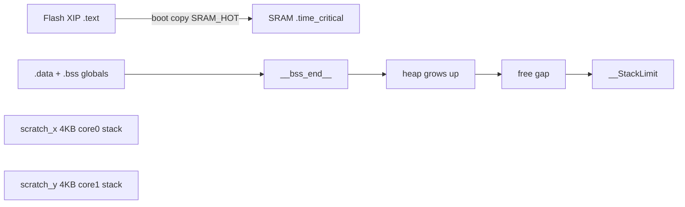

# SRAM, heap, and stack on the DCO6

How to tell whether SRAM-pinned code is eating static RAM, whether `malloc`/LittleFS/USB is
growing the heap, or whether a core is about to smash its 4 KB stack.

- **CPU time** (different question): [`BENCHMARKING.md`](BENCHMARKING.md)
- **Dump command:** `PARAM_DEBUG_COMMAND` **13** — [`mem_diag.ino`](../mem_diag.ino),
  Diagnostics button in [`tools/dco_control`](../tools/dco_control/README.md). Needs
  `ENABLE_MEM_DIAG`. Runtime **14/15** disable/enable loop polls.
- **Placement flags:** [`BUILD_FLAGS.md`](BUILD_FLAGS.md) — `SRAM_HOT_ENABLE`,
  `SRAM_DATA_ENABLE`, `ADSR_BEZIER_SRAM_HOT`, `MO_LFO_SRAM_HOT`

> 🔴 **`ENABLE_MEM_DIAG` is currently unreachable.** It is written inside the
> `#elif defined(RUNNING_AVERAGE)` branch of the profiler chain in
> [`settings.h`](../settings.h), and `ENABLE_SWD_TELEMETRY` wins that chain — so the `#define`
> never compiles, and **cmd 13 answers `compiled out`**. To use the RAM dump you must comment
> out `ENABLE_SWD_TELEMETRY`, uncomment `RUNNING_AVERAGE`, and uncomment `ENABLE_MEM_DIAG`.
> See [`BENCHMARKING.md`](BENCHMARKING.md) §0.

---

## 1. Three different "memory problems"

SRAM-pinned code does **not** allocate on the heap. At boot the Pico SDK copies those function
bodies into SRAM (`.time_critical`). That raises static RAM use and **shrinks total heap**. Heap
*usage* still comes from `malloc` / `new` / LittleFS / TinyUSB / MIDI.

Arduino-Pico puts each core's stack in a **4 KB scratch bank** (X / Y), separate from main SRAM.
Stack overflow and heap exhaustion are different crashes.



| Symptom | What it actually is |
|---------|---------------------|
| `getTotalHeap()` drops after pinning more functions | Static SRAM tax (`.time_critical` + `.data`/`.bss`) |
| `getUsedHeap()` climbs after LittleFS / USB / MIDI | Real heap (`mallinfo().uordblks`) |
| Random Core1 glitches, `core1_free` near 0 | **Stack overflow** (~4 KB), not heap. Suspect large locals in `voice_task_*` |
| `getFreeHeap()` looks large but a big `malloc` fails | Fragmentation — free is an **upper bound** |

Do **not** use `PICO_COPY_TO_RAM` (whole sketch in SRAM).

---

## 2. The placement macros (`_shared/memory_port.h`)

The tree no longer writes `__not_in_flash_func` directly. Two portable macros wrap it, so the
same source compiles for RP2040/RP2350 **and** STM32H7:

```cpp
#define SRAM_HOT_ENABLE  1     // settings.h
#define SRAM_DATA_ENABLE 1
```

| Macro | RP2040 / RP2350 | STM32H7 / H750 | Other |
|---|---|---|---|
| `SRAM_HOT(fn)` | `__not_in_flash_func(fn)` | `__attribute__((section(".itcmram"), noinline, used))` | no-op |
| `SRAM_DATA` | `__attribute__((section(".data")))` | `__attribute__((section(".dtcm"), aligned(4)))` | no-op |

Aliases `DTCM_DATA` and `DTCM_BSS` both map to `SRAM_DATA` for older code.

Setting either master switch to `0` collapses its macro to a no-op across the whole tree — the
fastest way to A/B "what does pinning actually buy us?" without editing every call site.

> The STM32 branch adds **`noinline, used`** deliberately: without them GCC can inline an ITCM
> function back into a flash caller, or discard it entirely, silently undoing the placement.
> The RP2040 branch also defines a fallback `__not_in_flash_func(fn) fn` so the header survives
> a core that does not provide it.

Usage looks like `void SRAM_HOT(update_parameters)(uint8_t id, int16_t value)` — note the
function **name** is the macro argument.

---

## 3. Compile-time (no dump needed)

`arduino-cli` prints:

```
Sketch uses … bytes of program storage.
Global variables use X bytes of dynamic memory, leaving Y bytes for local variables.
```

`X` includes `.data` + `.bss` **and RAM-resident code**. Pinning more raises `X` and lowers `Y`.
That leftover is heap room in **main SRAM**, not the scratch stacks.

After a build, parse the `.map` or:

```bash
arm-none-eabi-nm --size-sort --print-size DCO6.ino.elf | grep time_critical
```

Look for `.time_critical.*` (each pinned function), large `.bss`, `__bss_end__`, `__StackLimit`.

### The two allocations that dominate

| Allocation | Size | When |
|---|---:|---|
| **`presetStoreRAM[PRESET_RAM_SLOTS][598]`** | **153 088 B** (RP2350, 256 slots) / **76 544 B** (RP2040, 128 slots) | **Always** |
| `ampCompLut[NUM_OSCILLATORS][7001]` | ~**109 KB** (`8 × 7001 × 2`) | Only with `USE_FLOAT_AMP_COMP` |

> 🔴 **The in-RAM preset bank is the single largest consumer in the firmware** — larger than the
> amp-comp LUT, and it is not optional. On RP2350 the two together are **~262 KB**, half the
> chip's 520 KB.
>
> This is also why `PRESET_RAM_SLOTS` is **128 on RP2040**: 256 slots would not fit alongside
> everything else in 264 KB. Only the lower half of the bank is RAM-cached there; the rest is
> read from the chunk files. See [`PRESET_STORE.md`](PRESET_STORE.md).

RP2040 shipping leaves float amp off, so the LUT is absent from that binary. FLOAT_QUAD / FIXED
stay available without it.

---

## 4. Runtime dump (cmd 13)

Needs **`ENABLE_MEM_DIAG`** (see the warning at the top). Works **without** `RUNNING_AVERAGE`
once reachable. Core 1 never prints.

| Gate | Effect on `loop` / `loop1` |
|------|----------------------------|
| `ENABLE_MEM_DIAG` undefined | Polls compile to empty inlines — zero cost; 13/14/15 ack `compiled out` |
| Flag on, cmd **14** | Runtime polls off (one volatile load per iteration). Dump 13 acks `off` |
| Flag on, cmd **15** (default) | Polls on; dump 13 works |

`bench_service(1)` is separate: empty without `RUNNING_AVERAGE`.

Core 1 snapshots `rp2040.getFreeStack()` in `mem_diag_poll_core1_work()`; Core 0 prints:

```
=== DCO RAM ===
mcu    RP2350  clk=…MHz  polls=on
sram   main=… static=… (…%) heap=… (…%)
heap   total=… used=… free=…  arena=… free_chunks=…
stack  core0 … free / … used / 4096   core1 … free / … used / 4096
layout sram=0x20000000 bss_end=0x… stack_limit=0x…
scratch_x=0x…..0x… (4096)  scratch_y=0x…..0x… (4096)
ram_text=…   or  (no __ram_text_* symbols — use the .map for .time_critical)
================
```

| Line / field | Source | Read it as |
|--------------|--------|------------|
| `mcu` / `clk` / `polls` | `PICO_RP2350` branch, `rp2040.f_cpu()`, `mem_diag_runtime_enabled` | Board + poll gate |
| `sram main` | `__StackLimit - SRAM_BASE` | Main SRAM, not scratch |
| `sram static%` | `__bss_end__ - SRAM_BASE` | Pin tax: `.data` + `.bss` + RAM-text. **A/B this**, not `heap used` |
| `sram heap%` | `getTotalHeap()` / main | Remainder after static |
| `heap total/used/free` | `rp2040.get*Heap()` | `used` = `mallinfo().uordblks`; `free` is an upper bound |
| `arena` / `free_chunks` | `mallinfo().arena` / `.ordblks` | `free_chunks == 1` ≈ unfragmented |
| `stack … used / bank` | `getFreeStack()` vs `__scratch_y_start__ - __scratch_x_start__`, else 4096 | Instantaneous SP, **not** high-water |
| `scratch_*` | start … start+bank | Do not use `__scratch_*_end__` (empty section → size 0) |
| `ram_text` | `__ram_text_start__` / `__ram_text_end__` if exported (declared `weak`) | Else `.time_critical` is inside `static` — use the `.map` |

`getFreeStack()` is invalid under FreeRTOS (this sketch is not). Sampling at the end of `loop1()`
misses peak depth **inside** `voice_task_*` — those frames have already returned. Near-zero at
poll time is still a red flag.

> **Core 1 is the one to watch.** It runs the voice task over 8 oscillators with float state, and
> `pio_defer_service()` before it, all inside 4 KB.

A/B after a placement change: dump 13 → change the pin → dump 13 again, plus a **period-only**
profiler dump so an SRAM win is not confused with a CPU regression.

---

## 5. What to pin (shipping policy)

Pin **leaves on the realtime path**. A RAM function that calls flash still XIP-misses on the
callee — so library hot methods must be SRAM too (`ADSR_BEZIER_SRAM_HOT`, `MO_LFO_SRAM_HOT`).

| Symbol | Rate | Core | SRAM? |
|--------|------|:----:|:-----:|
| `voice_task_float` / `voice_task_fixed_point` + `amp_chan_levels_fixed`, `get_chan_level_lookup_fast`, `interpolateRatioQ16_fast` | every frame | 1 | yes |
| `pio_defer_service` | every `loop1` | 1 | yes |
| `ADSR_update` | ~49 µs | **0** | yes |
| `update_CV_outs`, `mod_matrix_eval_pitch_q24` | every `loop` | **0** | yes |
| ADSR `getWave` / `noteOn` / `noteOff` (`ADSR_BEZIER_SRAM_HOT`) | ~49 µs | 0 | yes |
| LFO `getWaveQ15` / `_advanceUnitQ15` (`MO_LFO_SRAM_HOT`) | every `loop` | 0 | yes |
| `LFO1` / `LFO2` / `DRIFT_LFOs` wrappers | every `loop` / ~51 µs | 0 | yes |
| `microsTimer` / `microsTimer2` | every `loop` / `loop1` | 0 / 1 | yes |
| `update_parameters` + the `apply_param_*` setters | serial bursts | 0 | yes |
| `voiceAlloc` (`VOICE_ALLOC_SRAM_HOT 1`) | note-on | 0 | yes |
| `loop()` / `loop1()` | forever | — | **no** — would copy MIDI/serial/noise dispatch into `.time_critical` |
| `serial_panel_task` / `serial_usb_task` | ~1 ms | 0 | **no** |

> ⚠️ **The ADSR and CV writers moved to Core 0.** Earlier revisions of this table listed
> `ADSR_update` and `update_CV_outs` as Core 1 work at ~10 kHz. They run from `loop()` on
> **Core 0** under `timer49microsFlag` and every iteration respectively. The pinning advice is
> unchanged, but the core attribution matters when reading a dump or reasoning about contention.

---

## 6. Adding or removing a pin

1. Dump 13 (baseline `heap total` + stacks).
2. Add or drop `SRAM_HOT(...)` on **one** function, or flip one library `*_SRAM_HOT` flag.
3. Clean rebuild; note "Global variables use X".
4. Dump 13 again. `heap total` should move by roughly the function's `.time_critical` size.
5. Period-only profiler: `loop` / `loop1` mean **and max** must not regress if you unpinned
   something hot.

To measure the whole policy at once, set `SRAM_HOT_ENABLE 0` in `settings.h` and rebuild — every
`SRAM_HOT` collapses to a plain definition.
