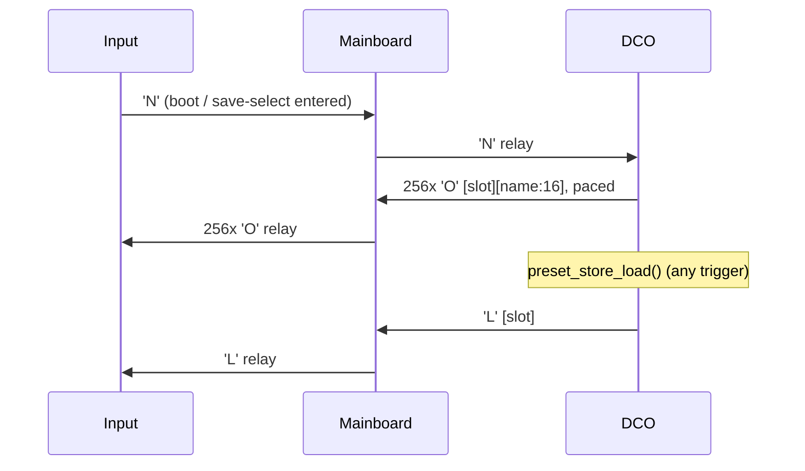

# Preset store — DCO6 specifics

The record format, the chunked LittleFS layout, the host protocol and the recall paths are a
shared contract, documented once for both projects:

- [`../_shared/docs/PRESET_STORAGE.md`](../_shared/docs/PRESET_STORAGE.md) — the 598-byte
  record, chunk addressing, `'p'` 170–173, `'B'`/`'C'`, `'N'`/`'O'`/`'L'`, host answer lines,
  recall paths, host JSON formats.
- [`../_shared/docs/FILESYSTEM.md`](../_shared/docs/FILESYSTEM.md) — the 512 KB partition, the
  full file inventory and the space budget.
- [`../_shared/docs/CALIBRATION_STORAGE.md`](../_shared/docs/CALIBRATION_STORAGE.md) — the
  calibration banks and their sizes on this board.

**This page is only what is different here.** Source of truth:
[`preset_store.h`](../preset_store.h) / [`preset_store.ino`](../preset_store.ino). Serial
how-to: [`README_serial_and_params.md`](README_serial_and_params.md). Topology:
[`SYSTEM_OVERVIEW.md`](SYSTEM_OVERVIEW.md). Host UI:
[`DCO-CONTROL-PANEL`](../../DCO-CONTROL-PANEL/README.md).

These 256 slots are the **only** preset storage in the instrument. Panel save/load, MIDI program
change, boot recall and the host all end up in the same records.

---

## Record layout

All little-endian. CRC32 covers bytes `[0 .. PRESET_OFF_CRC)`.

| Offset | Field | Size |
|-------:|-------|-----:|
| 0 | `PRESET_OFF_MAGIC` — `0xA5` | 1 |
| 1 | `PRESET_OFF_VERSION` — `1` | 1 |
| 2 | `PRESET_OFF_NAME` | 16 |
| 18 | `PRESET_OFF_BITMAP` — which params are set | 32 |
| 50 | `PRESET_OFF_PARAMS` — `PRESET_PARAM_COUNT` (256) × `int16` | 512 |
| 562 | `PRESET_OFF_BLOCKS` — `PRESET_BLOCK_FIELDS` (16) × `uint16` | 32 |
| 594 | `PRESET_OFF_CRC` | 4 |
| | **`PRESET_RECORD_SIZE`** | **598** |

`PRESET_RECORDS_PER_FILE` = 4 → `PRESET_CHUNK_SIZE` = **2392**, `PRESET_CHUNK_COUNT` = **64**
files (`pb00`…`pb63`) for `PRESET_NUM_SLOTS` = 256.

The 256-entry param array is indexed **directly by ParamId**, which is the other reason ids must
stay ≤ 255 (see [`README_serial_and_params.md`](README_serial_and_params.md)).

---

## In-RAM preset bank (sizes differ per MCU)

The whole bank is mirrored in RAM, and **how much of it fits depends on the MCU**:

```c
#if defined(PICO_RP2350) && PICO_RP2350
static constexpr uint16_t PRESET_RAM_SLOTS = 256;   // 520 KB RAM
#elif defined(PICO_RP2040) && PICO_RP2040
static constexpr uint16_t PRESET_RAM_SLOTS = 128;   // 264 KB RAM
#elif defined(__ARM_ARCH_6M__)                       // Cortex-M0+ (RP2040)
static constexpr uint16_t PRESET_RAM_SLOTS = 128;
#else
static constexpr uint16_t PRESET_RAM_SLOTS = 256;
#endif

extern uint8_t presetStoreRAM[PRESET_RAM_SLOTS][PRESET_RECORD_SIZE];
```

| MCU | Cached slots | `presetStoreRAM` | `PRESET_RAM_CHUNK_COUNT` |
|---|---:|---:|---:|
| RP2040 | 128 | **76 544 B** (~75 KB) | 32 |
| RP2350 | 256 | **153 088 B** (~150 KB) | 64 |

This is by far the **largest single RAM allocation in the firmware** — bigger than the
~109 KB amp-comp LUT. Two consequences:

- On **RP2040 only the first 128 slots are RAM-cached**; the upper half still lives on flash and
  is reached through the chunk files. Anything that assumes all 256 are in RAM is wrong there.
- The `#else` fallback assumes 256. A board package that defines neither `PICO_RP2350` nor
  `PICO_RP2040` nor `__ARM_ARCH_6M__` gets the large allocation by default.

`preset_store_init_ram()` populates it from `setup1()`, after `init_FS()`.

---

## Staging buffer

`PRESET_BULK_STAGING_SIZE` is **1440**, because the largest bulk target here is the 1408-byte
`voiceTables` bank (8 oscillators), not the 598-byte preset record. DCO3-MONOSYNTH, with three
oscillators, sizes it off the record instead and uses 640.

`PRESET_BULK_CHUNK_DATA` is **32** data bytes per `'B'` frame (36-byte payload with the header).

---

## Calibration banks — **six**, not seven

The three separate PW banks were **consolidated into one three-point bank**, and a new bank was
added. Current inventory (`_shared/FS.h`):

| File | Per-index size | Indexed by | Bank size |
|------|---:|---|---:|
| `voiceTables` | 176 B (22 × `[freq_x100:u32][range_pwm:u32]`) | oscillator | **1408 B** |
| **`PWCal3Pt`** | 18 B (`kPWCalPoints` 3 × `FSPWLimitsPointDataSize` 6) | PW channel | **72 B** |
| **`AmpCompTopPair`** | 1 B | oscillator | **8 B** |
| `ManualOffset` | 1 B (`i8`) | oscillator | **8 B** |
| `AmpComp440` | 2 B (`u16`) | oscillator | **16 B** |
| `AmpCompDutyOffset` | 2 B (`i16`, 0.01 %) | oscillator | **16 B** |

> 🔴 **`PWCenter`, `PWHighLimit` and `PWLowLimit` no longer exist as separate files.** They are
> now three *points* inside `PWCal3Pt`, exposed at runtime as
> `PW_CAL_LIMITS[NUM_PW_CHANNELS][kPWCalPoints]`. Any tool, dump parser or backup that still
> looks for the three old filenames will find nothing.
>
> The **writer functions kept their names** — `update_FS_PWCenter()`,
> `update_FS_PW_High_Limit()`, `update_FS_PW_Low_Limit()` all still exist and are still called
> from the PW search. They now address three points inside the one file. Do not infer the
> on-disk layout from the function names.
>
> **`AmpCompTopPair`** (top valid pair index per oscillator) is new and was not in the previous
> documentation at all.

---

## Bulk / cal-dump target ids

`PresetBulkTarget` and the `CAL_DUMP_*` constants share one numbering:

| Id | Target | Notes |
|---:|--------|-------|
| 0 | `PRESET_BULK_PRESET` | `CAL_DUMP_ALL` on the dump side |
| 1 | `..._VOICE_TABLES` | |
| 2 | `..._PW_3PT` | **Legacy alias `PRESET_BULK_PW_CENTER` = 2** kept for compatibility |
| 3 | `..._AMP_COMP_TOP_PAIR` | New |
| **4** | — | **Unused / skipped** |
| 5 | `..._MANUAL_OFFSET` | |
| 6 | `..._AMP_COMP_440` | |
| 7 | `..._AMP_COMP_DUTY` | |

Id **4 is a hole** in the enum — almost certainly one of the retired PW banks. Do not reuse it
without checking the host side (`fileformats.py`) first.

---

## Topology: the Mainboard relays everything

Input is not on Serial2 — the STM32 Mainboard is, and it relays preset frames in both
directions:

```
Input  <-- Serial8 -->  Mainboard  <-- Serial2 -->  DCO  <-- USB CDC -->  DCO-CONTROL-PANEL
```



**Every relayed byte needs its own Mainboard LUT row.** `'N'` is registered in
`inputSerial8Commands[]` and `'O'`/`'L'` in `mainSerial2Commands[]`
([`../../MAINBOARD-CONTROLLER/Serial.ino`](../../MAINBOARD-CONTROLLER/Serial.ino)). An
unregistered command byte is dropped silently in transit, with no error on either end.

**Two command tables, so the links carry different commands.** `usbSerialLut` is drained from
USB CDC only; `mainboardSerialLut` is drained from Serial2:

| Frame | USB (`usbSerialLut`) | Serial2 (`mainboardSerialLut`) |
|---|---|---|
| `'p'` 170–173 | yes | yes |
| `'B'` / `'C'` bulk | **yes** | no |
| `'N'` directory request | no | **yes** |
| `'s'` screen signal | **yes** | no |
| `'q'`, block frames | yes | yes |

> The tables are built from `usbSerialCommands[]` and `mainboardSerialCommands[]` in
> `Serial.ino`. Earlier revisions called the USB one `inputSerialLut` / `inputSerialCommands[]`;
> that name no longer exists.

So bulk restore is a **USB-only** path, and the host cannot request a directory push — it reads
`[pdir]` text from `'p'` `PARAM_PRESET_DUMP` = −1 instead. On DCO3 a single LUT serves both links
and all of these work either way.

The Mainboard-side handlers for the panel's block and name frames exist so the DCO can shadow the
panel's envelope, filter and name state and build an accurate record even though it never sees
Input directly. They only re-emit on USB ingress (`serial_forward_usb_edit_to_mb()` returns early
unless `g_param_ingress == PARAM_SRC_USB`), so nothing bounces back.

---

## Block mirroring on load

EnvVCA, EnvVCF and the filter block are mirrored to the **Mainboard** over Serial2
(`serial_send_adsr_vca_block_to_mb()` / `..._vcf_...` / `serial_send_filter_block_to_mb()`) so
its analog VCA and VCF CVs follow the recalled patch.

`'c'` (EnvDCO) is also sent, but **carries no CV** — its engine is DCO-local. It goes out only so
the Mainboard can relay EnvDCO to the panel faders and the Screen.

> ⚠️ **Block values bypass the shadow.** `'a'`–`'d'` write their globals directly and never pass
> through `update_parameters()`, so `preset_shadow_capture()` never sees them. The record picks
> them up from the block payload at save time instead. This matters because ParamIds **226–237**
> (`ADSR1/2/3_{ATTACK,DECAY,SUSTAIN,RELEASE}`) address the *same* envelope values through the
> router — if both paths are used, a save can capture a different value than the one sounding.
> See the open question in [`README_serial_and_params.md`](README_serial_and_params.md).

---

## Screen silencing around a load

`preset_record_apply()` mirrors every persistable param and all four blocks to the Mainboard,
which forwards them to the Screen as parameter toasts — a full patch recall would flood it. So
`preset_store_load()` brackets the apply:

1. `serial_send_screen_signal_to_mb(SCREEN_SIGNAL_SILENT)` — value **6** — before applying.
2. `serial_send_preset_loaded_to_mb(slot)` — `'L'`, for the panel.
3. `serial_send_preset_scroll_to_mb(slot)` — slot + name for the Screen.
4. `serial_send_screen_signal_to_mb(SCREEN_SIGNAL_PRESET_SCROLL)` — value **1** — lifts silence.

Both markers sit past record validation, so they stay balanced on every caller path: boot recall,
MIDI program change, host command and panel-triggered load.

The Screen also arms an `expireSilentMode` watchdog when it receives signal 6, so a lost "lift"
frame cannot leave the UI mute forever.

---

## The directory push is paced

256 `'O'` frames are 4864 bytes, which at 2.5 Mbaud is **19.5 ms of unbroken traffic** — more
than the Mainboard can receive and relay on to Input while it is also running the LFOs, envelopes
and DAC writes. Sending them in one go loses most of the directory.

So `preset_store_send_directory_to_mb()` only **arms** the push, and
`preset_store_dir_push_task()` sends one chunk — 4 slots, 76 bytes on the wire — per 1 ms tick:
256 slots in **64 ms**, about 76 kB/s, which every buffer along DCO → Mainboard → Input absorbs
without dropping an entry. One file open per tick, the same total as the old blast. A repeat
`'N'` just restarts the cursor.

`preset_store_dir_push_task()` is called from **`loop()` on `timer1msFlag`**, and also once from
`setup()` under `REMEMBER_LAST_PRESET`.

DCO3 has no equivalent task; on its direct link it blasts all 256 frames in one call.

---

## Boot recall

```c
static constexpr uint32_t PRESET_BOOT_RECALL_MS = 1500;
extern bool presetBootPending;
```

> ⚠️ **`REMEMBER_LAST_PRESET` is commented out in [`settings.h`](../settings.h).** So
> `preset_store_boot_recall()` / `preset_store_boot_task()` and the `pstLast` write path are
> **not compiled**, and `setup()` takes the `#else` branch: a hard-coded
> **`preset_store_load(4)`**. The instrument always boots into slot 4, not the last used one.
>
> Enable the flag to get the deferred ~1.5 s recall back.

---

## Persistable parameters

`preset_param_is_persistable()` is the common version. DCO3's extra sub-oscillator range (90–99)
is absent here — those parameters do not exist on this board.

---

## Host file format tags

`dco4-patch`, `dco4-bank`, `dco4-cal` — **unchanged**, because `PROJECT_INSTRUMENT` is still 4.
Do not rename them to `dco6-*` without migrating the host codecs and every stored file.

The cal file carries the decoded tables. **It must be regenerated for the six-bank layout**:
`amp_comp` (8 osc), `pw_cal_3pt` (4 channels × 3 points), `amp_comp_top_pair` (8),
`manual_offset` (8), `amp_comp_440` (8), `amp_comp_duty` (8).

Patch and bank files share one param numbering with DCO3-MONOSYNTH and load on either model; cal
files are strictly per-model because the table sizes differ.

---

## Related files

| File | Role |
|---|---|
| `preset_store.h` / `.ino` | Record layout, CRC, chunked save/load/dump, bulk, RAM bank, paced `'O'` directory push |
| `FS.ino` | One-line shim → `_shared/FS_impl.h`: cal banks, `write_fs_bank()` shared with bulk restore |
| `_shared/FS.h` | Bank sizes, buffers, `PW_CAL_LIMITS[][]`, prototypes |
| `_build_libs/DCO-PROTOCOL/params_def.h` | ParamIds 170–173 (canonical superset, byte-identical on every board) |
| `params.ino` | `apply_param_preset_*` / `apply_param_cal_dump`; `preset_shadow_capture()` in `update_parameters()` |
| `Serial.ino` | `'B'`/`'C'` handlers, block-echo helpers after load, `'N'` handler, `serial_send_preset_loaded_to_mb()`, `serial_send_preset_scroll_to_mb()`, `serial_send_screen_signal_to_mb()` |
| `_build_libs/DCO-PROTOCOL/serial_input_protocol.h` | Command bytes / payload lengths for `'q'`, `'B'`, `'C'`, `'N'`, `'O'`, `'L'` **and** the `SCREEN_SIGNAL_*` constants |
| `midi.ino` | Bank Select CC 0/32 + Program Change → load |
| [`../../MAINBOARD-CONTROLLER/Serial.ino`](../../MAINBOARD-CONTROLLER/Serial.ino) | Relay tables: `'q'`/`'N'` Input→DCO, `'O'`/`'L'` DCO→Input |
| [`../../INPUT-CONTROLLER/presetStorage.ino`](../../INPUT-CONTROLLER/presetStorage.ino) | Input's RAM-only `presetDir[256]` cache; `'N'`/`'O'`/`'L'` client side |
| [`../../DCO-CONTROL-PANEL/mcu_link.py`](../../DCO-CONTROL-PANEL/mcu_link.py) | Queued dump / bulk ops over CDC text |
| [`../../DCO-CONTROL-PANEL/fileformats.py`](../../DCO-CONTROL-PANEL/fileformats.py) | JSON + binary codecs (model-aware) |

> ❌ **`serial_protocol.h` does not exist.** The `SCREEN_SIGNAL_*` constants live in the shared
> `serial_input_protocol.h`.
