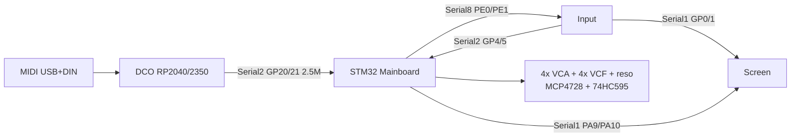
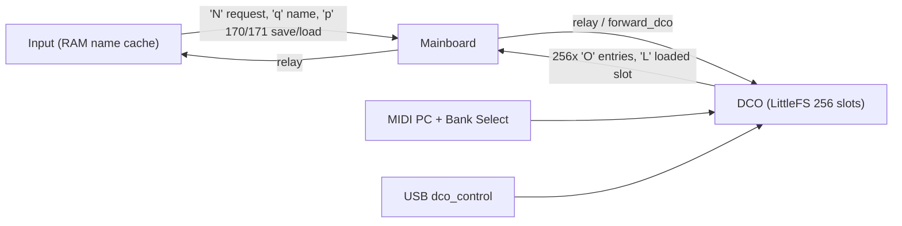

# DCO6 System Overview

DCO6 is a **digitally controlled analog polysynth** on **classic DCO4 PCB wiring**: STM32
Mainboard in the UART middle, **4 MIDI voices × 2 oscillators**. Control math is DCO3-style
(Q15/Q24, bake-on-write, slim LE serial, jump-table ParamIds).

> **Naming.** DCO6 is a revision of DCO4-REBORN on the same codebase — the sketch is
> `DCO6.ino` in `DCO6/`. The **`PROJECT_INSTRUMENT` value is still `4`**; the "6" is a
> revision name, not a voice count. Active `#if PROJECT_INSTRUMENT == 4` branches live in
> `settings.h` and `_shared/FS_impl.h`.

Board-specific detail lives in each folder’s `docs/`. Reintegration contract:
[`MAINBOARD_REINTEGRATION.md`](MAINBOARD_REINTEGRATION.md) and
[`../../MAINBOARD-CONTROLLER/docs/MAINBOARD_REINTEGRATION.md`](../../MAINBOARD-CONTROLLER/docs/MAINBOARD_REINTEGRATION.md).

---

## Boards and ownership

| Board | Folder | MCU | Owns |
|-------|--------|-----|------|
| **DCO** | `DCO6/` | RP2040 / RP2350 | MIDI (USB+DIN), voice alloc (mono/poly/stack), PIO pitch, RANGE/PW PWM, amp-comp, autotune, LittleFS (cal + **the instrument's 256 preset slots**), Character pitch/PW jitter, per-osc **pitch** drift |
| **Mainboard** | `MAINBOARD-CONTROLLER/` | STM32 | EnvVCA ×4, EnvVCF ×4, EnvDCO ×4, LFO1/LFO2, VCF drift, mod matrix, VCA/VCF/reso PWM, MCP4728, 74HC595, Input RX, DCO peer, **preset frame relay** |
| **Input** | `INPUT-CONTROLLER/` | RP2040 | Panel scan, Screen UI frames; relays gap 154. **No filesystem** — RAM-only cache of the 256 preset names, refilled from the DCO |
| **Screen** | `SCREEN-CONTROLLER/` | RP2040 | LVGL UI |
| Voice aux | `VOICE-AUX/` | RP2040 | Optional Dist / filter-mode helper |

Voice and oscillator counts are declared once in [`globals.h`](../globals.h):

```c
#define NUM_VOICES_TOTAL 4
#define NUM_OSCILLATORS  8
#define NUM_PW_CHANNELS  NUM_VOICES_TOTAL
#define NUM_FILTERS      2
```

Voice modes via `setVoiceMode()`: `0` mono (one MIDI voice → osc pair 0/1) · `1` poly
(4 independent 2-osc voices) · `2` stack (all 4 voices, same note).

OSC3 ParamIds stay in the enum for presets: **34, 35, 36, 39 and 90–92** (plus the additive
LFO depths 218 / 220). Analog 4×2 has OSC A / OSC B / Sub levels only — OSC3 level dest is a
no-op on Mainboard. **Dist is `PARAM_DIST_DRIVE` 58 / `PARAM_DIST_MIX` 59**, stubbed unless
that analog exists.

> ⚠️ **Do not reuse the pre-2026-09 numbers.** An earlier revision of this page listed
> *"OSC3 ParamIds (33–35, 38, 87–89)"* and *"Dist 52–53"*. Against `params_def.h` all of those
> are wrong today: 33 is `PARAM_PORTAMENTO_MODE`, 38 is `PARAM_SUBOSC_DIVIDE`, 87–89 are the
> **OSC2** wave enables (OSC3's are 90–92), and 52–53 are `PARAM_ADSR2_DECAY_CURVE` /
> `PARAM_ADSR2_RELEASE_CURVE`. If these IDs were ever renumbered rather than mis-documented,
> presets written under the old map load values into the wrong parameter — verify with
> `gen_midi_map.py --check` before trusting old records.

**ParamId space:** `params_def.h` is one canonical superset, byte-identical across all seven
live board copies of both projects; the master lives at `DCO3-MONOSYNTH/DCO/params_def.h` —
edit there and copy out. It is not a per-board fork: each board routes a subset, and existing
ids are never renumbered. `serial_input_protocol.h` shares its command values and payload
lengths the same way, but each board's copy is trimmed to the commands that board parses or
sends.

**IDs must be ≤ 255.** The router is an O(1) jump table of `PARAM_ROUTER_JUMP_SIZE` (256)
entries and `update_parameters()` takes a `uint8_t` id, so an id ≥ 256 is dropped silently —
no compile error, no runtime error, the parameter simply never applies. `ParamId` being
declared `uint16_t` is misleading: the routable space is 8 bits.

---

## Inter-board links (classic DCO4 PCB)



| Link | Baud | Peers | Role |
|------|------|-------|------|
| DCO DIN MIDI (`uart0`) | 31 250 | DIN MIDI | MIDI in, GP0 TX / GP1 RX, exclusive IRQ `on_midi_uart_rx` |
| DCO `Serial2` GP20 TX / GP21 RX | 2 500 000 | Mainboard `Serial2` PD5/PD6 | see command tables below |
| DCO USB CDC | 2 000 000 | host `dco_control` | bench link |
| Input `Serial2` GP4/5 | 2.5M | Mainboard `Serial8` PE0/PE1 | slim `'a'`–`'d'`/`'p'`/`'q'`/`'N'` Input→MB; `'x'`/`'p'`/`'O'`/`'L'` MB→Input |
| Input `Serial1` GP0 | 2.5M | Screen `Serial1` GP13 | UI frames + relayed gap 154 |
| Mainboard `Serial1` | 2.5M | Screen (optional second feed) | unused if Input already mirrors UI |

Verified in `init_serial()` ([`Serial.ino`](../Serial.ino)): `Serial2.setFIFOSize(2048)`,
`Serial2.setPollingMode(false)`, `Serial2.setRX(21)`, `Serial2.setTX(20)`,
`Serial2.begin(2500000)`, DMA TX armed with `serial_dma_init_rp2040(0, uart1)`.
DIN MIDI is raw `uart0` at 31 250 with an exclusive IRQ handler, not an Arduino `Serial1`
object.

### What the DCO accepts from the Mainboard

`mainboardSerialCommands[]` — **9 rows**:

| Cmd | Constant | Len | Handler |
|-----|----------|-----|---------|
| `'p'` | `CMD_PARAM_16` | 3 | `dco_rx_handle_param16` |
| `'m'` | `CMD_MOD_STREAM` | 16 | `mb_handle_mod_stream` |
| `'t'` | `CMD_BENCH_TEXT` | 16 | `mb_handle_bench_text` |
| `'a'` | `CMD_ADSR1_BLOCK` | 8 | `dco_rx_handle_adsr1` |
| `'b'` | `CMD_ADSR2_BLOCK` | 8 | `dco_rx_handle_adsr2` |
| `'c'` | `CMD_ADSR3_BLOCK` | 8 | `dco_rx_handle_adsr3` |
| `'d'` | `CMD_FILTER_BLOCK` | 8 | `dco_rx_handle_filter_block` |
| `'q'` | `CMD_PRESET_NAME` | 16 | `dco_rx_handle_preset_name` |
| `'N'` | `CMD_PRESET_DIR_REQUEST` | 1 | `dco_rx_handle_preset_dir_request` |

### What the DCO accepts from USB CDC

`usbSerialCommands[]` — **9 rows**: `'a'` `'b'` `'c'` `'d'` `'p'` `'q'` ·
`'s'` `CMD_SCREEN_SIGNAL` (1 B) · `'B'` `CMD_BULK_CHUNK` (36 B) · `'C'` `CMD_BULK_COMMIT` (8 B).

The two tables overlap but are **not** the same: a command registered in only one is
unreachable from the other transport.

### What the DCO sends to the Mainboard

`'n'` note-on (4 B) · `'o'` note-off (1 B) · `'e'` expression (4 B) · `'p'` param16 (3 B) ·
`'x'` param32 (5 B) · `'s'` screen signal (1 B) · `'O'` preset dir entry (17 B) ·
`'L'` preset loaded (1 B) · `'v'` `'l'` `'Q'` `'M'` patch blocks (OSC / LFO / MIX / MOD) ·
ADSR and filter blocks.

Canonical set: **24 commands** in `enum SharedSerialCmd`
(`DCO-PROTOCOL/serial_input_protocol.h`). Canonical dimensions: `PRESET_NUM_SLOTS = 256`,
`PRESET_NAME_LEN = 16`, `MOD_SLOT_COUNT = 8`. Max inner payload:
`SERIAL_INNER_MAX_PAYLOAD = 40` (`serial_frame.h`).

Protocol is **slim little-endian**, no finish byte. PW = `'p'` 210, ADSR1→VCA = `'p'` 222.
Do not restore BE `'p'` or Input `'e'`/`'f'` blocks.

Gap 154 / cal 155: DCO `'x'` → Mainboard → Input → Screen (154 only on Screen).

**The Mainboard is a relay, not a bus.** Nothing crosses it implicitly. A pass-through
command byte (`'a'`–`'d'`, `'q'`, `'N'`, `'O'`, `'L'`, `'x'`) only reaches the far side if it
has a row in `inputSerial8Commands[]` (Input→DCO) or `mainSerial2Commands[]` (DCO→Input) in
[`../../MAINBOARD-CONTROLLER/Serial.ino`](../../MAINBOARD-CONTROLLER/Serial.ino); an
unregistered byte is dropped in transit, silently, on both ends. `'p'` is not forwarded
blindly: the Mainboard applies each ParamId through its own `paramTable[]` and re-emits the
DCO-owned ones with `forward_dco()`, so a new DCO ParamId needs an applier row there too.

### Echo prevention

The DCO tags every ingress frame so Mainboard traffic never bounces back onto Serial2
([`Serial.ino`](../Serial.ino)):

```cpp
enum ParamIngress : uint8_t {
  PARAM_SRC_MAINBOARD = 0, // Arrived from hardware UART (Serial2)
  PARAM_SRC_USB       = 1, // Arrived from Host PC CDC (Serial)
};
```

There is **no `PARAM_SRC_INPUT`**: on this wiring the DCO's only peer UART is the Mainboard,
and panel edits arrive relayed through it. The single gate is
`serial_forward_usb_edit_to_mb()`, which returns early unless the tag is `PARAM_SRC_USB`.

---

## Dual-core execution

Four entry points ([`DCO6.ino`](../DCO6.ino)):

| Entry point | Core | Does |
|---|---|---|
| `setup()` | 0 | `sys_clock_hz_refresh` → `init_micros_timers` → `init_usb` → `init_serial` → `init_param_router` → `init_midi` → `init_LFOs` → `init_DRIFT_LFOs` → preset recall → cal pin `INPUT_PULLUP` |
| `setup1()` | 1 | `seed_fake_calibration_tables(false)` → `init_FS` → `preset_store_init_ram` → `init_ADSR` → `init_cv_out` → `mod_matrix_init` → `init_waveSelector` → `precompute_amp_comp_for_engine` → `precompute_pw_regions` → `init_pwm` → `init_pio` → `init_voices` → bus priority to Core 1 |
| `loop()` | 0 | MIDI USB+DIN every iteration · `Serial2` + USB CDC on `timer1msFlag` · `ADSR_set_parameters` on `timer5msFlag2` · `LFO1()`/`LFO2()` · `DRIFT_LFOs` ~51 µs · **`ADSR_update` ~49 µs** · noise · `update_CV_outs` · bench/mem housekeeping |
| `loop1()` | 1 | `microsTimer2()` → **calibration trap** → `pio_defer_service` → `voice_task_main` → housekeeping |

Core 1 takes the bus (`bus_ctrl_hw->priority = BUSCTRL_BUS_PRIORITY_PROC1_BITS`): it is the
audio core. No serial or printing happens there.

**Calibration trap** — a single early return, not an auto/manual branch:

```cpp
if (__builtin_expect(calibrationFlag || calibrationVerifyRequested, 0)) {
    autotune_loop_task();
    return; // EARLY EXIT: voice_task_main() is never reached while calibrating!
}
```

`DCO_calibration()` and `DCO_calibration_debug()` are called **inside** `autotune_loop_task()`,
not from `loop1()`. Note the second condition, `calibrationVerifyRequested`.

> `ADSR_update()` runs on **Core 0**, not Core 1. Older revisions of the docs placed it in the
> `loop1()` play branch.

---

## Preset authority

The DCO owns the only preset storage in the instrument: 256 LittleFS slots
([`PRESET_STORE.md`](PRESET_STORE.md)). Input has no filesystem; it caches the 256 slot names
in RAM and asks the DCO to refill that cache with `'N'`, receives 256 `'O'`
`[slot][name:16]` entries, and learns the current slot from `'L'` `[slot]` after every
successful load — including loads it did not trigger (boot recall, MIDI program change,
USB `dco_control`).



Panel edits of envelope/filter blocks (`'a'`–`'d'`) and the preset name (`'q'`) are applied on
the Mainboard **and** forwarded to the DCO, because the DCO builds each record from its own
copies of those values and has no direct link to the panel.

> **Boot recall.** `REMEMBER_LAST_PRESET` is currently **commented out** in
> [`settings.h`](../settings.h), so `setup()` compiles the `#else` branch and the instrument
> always boots into **`preset_store_load(4)`** — slot 4, not the last used one.

---

## Feature flags ([`settings.h`](../settings.h))

Engine math flags are **not** in the sketch. They live in `settings.h`, which `DCO6.ino`
includes near the top under the `SETTINGS FILE !!!! CRITICAL` banner.

| Flag | State in tree | Role |
|------|---------------|------|
| `ENABLE_MAINBOARD_LINK` | **on** | Serial2 = Mainboard peer |
| `ENABLE_MB_MOD_STREAM` | **off (commented)** | Opt-in. While off, the DCO runs LFO1/2, **all** envelopes and matrix→pitch locally; `'m'` is still parsed but ignored for pitch mailboxes |
| `ENABLE_USB_CONTROL` | **on** | USB CDC panel frames for bench. Comment out for production — stray terminal bytes are read as frame headers |
| `DCO_PROTOCOL_IMPLEMENT_DMA` | **on** | DMA TX path |
| `ENABLE_PIO_RESET_INVERT` | **on** | RESET pad active-low (DG411 discharge) |
| `SRAM_HOT_ENABLE` / `SRAM_DATA_ENABLE` | **1** | Hot code/data into SRAM |
| `ENABLE_CV_OUTS` / `ENABLE_WAVE_MUX` | **off** | Analog writers stay compiled out on this board |
| `ENABLE_VOICE_AUX` | **off** | Solo RP2350B / single-MCU |
| `RANGE0_PIO_DITHER_TEST` | **off** | No spare SMs with 8 oscs; HW PWM slices instead |
| `REMEMBER_LAST_PRESET` | **off** | See boot recall note above |
| `SERIAL_FRAMING_COBS` | **off** | RAW framing default; host A/B with `dco_control --cobs` |

Calibration defaults in the same file: `PW_POLARITY_INVERTED 0`,
`AMP_DUTY_INVERT_OSC_A/B true`, `AMP_DUTY_INVERT_ALL false`,
`AMP_TARGET_DUTY_OSC_A 0.50f`, `AMP_TARGET_DUTY_OSC_B 0.62f`.

> ⚠️ `PW_SWEEP_MODE_DEFAULT` is currently defined twice: the `PROJECT_INSTRUMENT == 4` block
> sets it to `0` (FULL) and a later line redefines it to `1` (HALF_HIGH) with its `#undef`
> still commented out. Resolve that before relying on either value.

Pin map: [`PINOUT.md`](PINOUT.md) · Mod matrix: [`MOD_MATRIX.md`](MOD_MATRIX.md) ·
Engine math: [`ENGINE_OPTIONS.md`](ENGINE_OPTIONS.md) ·
Serial/params detail: [`README_serial_and_params.md`](README_serial_and_params.md).
