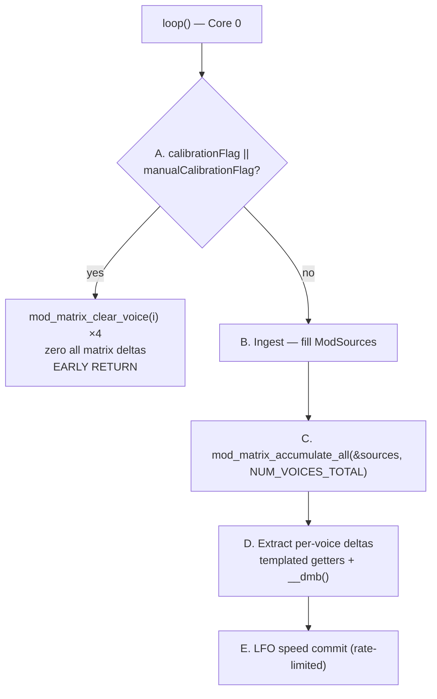

# `update_CV_outs` Hot-Path Map

Readable map of the CV / modulation path on the DCO. Live source of truth is
[`cv_out.ino`](../cv_out.ino) — this doc does not paste full bodies.

> 🔴 **Rewritten 2026-09-16.** The function was restructured into a staged polyphonic pipeline
> and **no longer computes or writes VCA / VCF / resonance CVs on this board** — the Mainboard
> owns that analog. The previous revision documented the DCO3/monosynth shape: VCA and VCF
> combine formulas, `mod_matrix_apply_cv()`, `mod_matrix_read_source_q15()`, a Core 1 call site
> and a "~10 kHz" rate. None of that matches the current code. See
> [§7](#7-what-changed) for the migration table.

**How to read this doc:** the staged pipeline in [§2](#2-the-five-stage-pipeline) is the whole
function. Mod-depth baking (`/512` vs `/1024`, when to call the bakers) stays in
[`CV_MOD_SCALES.md`](CV_MOD_SCALES.md). The matrix itself is [`MOD_MATRIX.md`](MOD_MATRIX.md).

---

## 1. Where it runs

**Core 0, from `loop()`, every iteration** — not Core 1, and not gated behind a timer flag:

```cpp
BENCH_BEGIN(loop0_cv_outs);
update_CV_outs();
BENCH_END(loop0_cv_outs);
```

The bench probe is `loop0_cv_outs`. The banner still prints `cv=FLOAT|FIXED` from
`USE_FLOAT_CV_OUTS`, which on this tree is **on for RP2350** and off for RP2040 — the opposite of
what older docs claimed.

Declared `void SRAM_HOT(update_CV_outs)()`, so it is pinned into SRAM
([`MEMORY.md`](MEMORY.md)).

---

## 2. The five-stage pipeline



### A. Calibration guard — *before* the bench macros

```cpp
if (__builtin_expect(manualCalibrationFlag || calibrationFlag, 0)) {
    for (uint8_t i = 0; i < NUM_VOICES_TOTAL; i++) {
        mod_matrix_clear_voice(i);
        // zero matrix_pitch_mod_*, osc1/osc2 pitch, pw, xmod
    }
    return;
}
```

The guard is deliberately **above** `BENCH_BEGIN` so a calibration frame cannot produce a corrupt
probe span. Every per-voice matrix delta is zeroed, so a moving CV cannot corrupt a gap
measurement.

### B. Ingest — build `ModSources`

Global taps, once:

| Field | Source |
|---|---|
| `lfo1` / `lfo2` / `lfo3` | `LFO1Level` / `LFO2Level` / `LFO3Level` (Q15) |
| `noise` | `noiseLevel[0]` |
| `pitch_bend` | `midi_pitch_bend − 8192` |
| `drift_global` | `LFO_DRIFT_LEVEL[0]` |
| `expression` | `expression_q15` (CC 11) |
| `breath` | `breath_q15` (CC 2) |

Then a `#pragma GCC unroll 4` loop for the per-voice taps:

| Field | Source | Note |
|---|---|---|
| `drift_voice[i]` | `LFO_DRIFT_LEVEL[i*2]` | Osc A of the pair |
| `env_vca[i]` | `ADSR_VCA_Level_q15[i]` | |
| `env_dco[i]` | `ADSR3Level_q15[i]` | |
| `env_vcf[i]` | `ADSR_VCF_Level_q15[i]` | |
| `velocity[i]` | `velocity[i]` | |
| `keytrack_note[i]` | `VOICE_NOTES[i] ? … : 60` | Idle voice falls back to note 60 |

Probe: `cv_ingest`. Everything is integer Q15 here regardless of engine.

### C. Accumulate

```cpp
mod_matrix_accumulate_all(&sources, NUM_VOICES_TOTAL);
```

One call evaluates all eight slots for all four voices. Probe: `cv_matrix`.
See [`MOD_MATRIX.md`](MOD_MATRIX.md).

### D. Extract deltas — the float / fixed split

```cpp
#if defined(USE_FLOAT_VOICE_TASK)
  matrix_pitch_mod_f[i]      = mod_matrix_get_dest_float<DEST_PITCH>(i);
  matrix_osc1_pitch_mod_f[i] = mod_matrix_get_dest_float<DEST_OSC1_PITCH>(i);
  matrix_osc2_pitch_mod_f[i] = mod_matrix_get_dest_float<DEST_OSC2_PITCH>(i);
#else
  matrix_pitch_mod_q24[i]      = mod_matrix_get_dest_fast<DEST_PITCH>(i);
  matrix_osc1_pitch_mod_q24[i] = mod_matrix_get_dest_fast<DEST_OSC1_PITCH>(i);
  matrix_osc2_pitch_mod_q24[i] = mod_matrix_get_dest_fast<DEST_OSC2_PITCH>(i);
#endif
  matrix_pw_mod[i]   = mod_matrix_get_dest_fast<DEST_PW>(i);
  matrix_xmod_mod[i] = mod_matrix_get_dest_fast<DEST_CROSSMOD_DEPTH>(i);
__dmb();
```

The getters are **templates on the destination id**, so the offset is a compile-time constant.
`..._float` yields octaves (`1.0f` = 1 oct); `..._fast` yields Q24. PW and crossmod always take
the integer getter.

**The `__dmb()` is load-bearing** — it guarantees Core 1's voice task sees a complete set of
deltas rather than a half-written mix. Do not drop it when refactoring. Probe: `cv_deltas`.

### E. LFO speed commit

```cpp
static constexpr uint32_t LFO_DEST_SLEW_US = 201u;
```

`lfo_commit_speed_if_changed()` reprograms an LFO only when its matrix destination
(`DEST_LFO1/2/3_SPEED`) **or** its panel speed value changed:

- **Panel speed change → commits immediately.**
- **Destination-only change → rate-limited to one commit per 201 µs**, shared across all three
  LFOs via a single `last_dest_flush_us`.

This exists because `setMode0Freq()` is comparatively expensive and a matrix-driven rate sweep
would otherwise call it every iteration. Frequency comes from
`fast_exp_speed_5000(speed + dest)`. Probe: `cv_lfo_subloop`.

---

## 3. What this function no longer does

`VCA_PWM[]`, `VCF_PWM[]`, `RESONANCE_PWM[]` and `AS2164_VCA_linearize_table[4096]` are still
**declared** in `cv_out.ino` (as `SRAM_DATA`), and the table is still generated by
`generateBezierArray(...)` in `init_cv_out()`. But **nothing in `update_CV_outs()` computes or
writes them any more.**

On this instrument the STM32 Mainboard owns VCA, VCF, resonance and the mixer DACs. The DCO
sends it envelope and filter **blocks** (`'a'`–`'d'`) and parameter frames; the Mainboard runs
its own combine and drives the analog.

So the formulas the previous revision documented — resonance→VCA compensation, the keytrack
per-voice Q15 table, `VCA_Calculated`, the dual-filter `combined0/1` sum, the
`4095 − clamp_u12(...)` cutoff inversion — describe **the Mainboard's job**, or the DCO3
single-board build. They are not in this file's hot path.

`ENABLE_CV_OUTS` (**off**) still gates the writers in [`PWM.ino`](../PWM.ino) for a future
expansion where the DCO drives that analog directly; see [`PINOUT.md`](PINOUT.md) for why the
draft pins collide with the 8-oscillator RESET/RANGE map.

---

## 4. Manual calibration path

```cpp
void update_CV_outs_manual_calibration() {
#ifndef ENABLE_CV_OUTS
  byte stage = (byte)manualCalibrationStage;
  waveSelector_manual_calibration(stage);
#endif
}
```

With `ENABLE_CV_OUTS` off — the shipping case — it only drives the wave selector for the current
calibration stage. It does **not** open the filter or mute the mix, because this board does not
own those CVs.

---

## 5. Baked scales and helpers

Still live in `cv_out.ino`:

| Helper | Role |
|---|---|
| `cv_bake_adsr2_to_vcf_scale()` | Bake EnvVCF→cutoff depth on write |
| `cv_bake_lfo2_to_vcf_scale()` | Bake LFO2→cutoff depth |
| `cv_bake_lfo1_to_vca_scale()` | Bake LFO1→VCA depth |
| `cv_update_mod_scales()` | Recompute all of the above |
| `cv_q15_to_u12(q15)` | `(q15 * CV_U12_SCALE) >> 15`, `CV_U12_SCALE = 4096` |
| `cv_clamp_u12(v)` | Clamp to `CV_U12_MAX = 4095` |
| `lerp_0_4095(x, y0, y1)` | `y0 + ((y1 − y0) * x) >> 12` — divide by 4096, not 4095 |
| `init_cv_out()` | Zero state, build `AS2164_VCA_linearize_table` via `generateBezierArray` |

The bakers are called from the `'d'` filter-block handler and the relevant `apply_param_*`
setters — **bake on write**, never per tick. Details and the peak math:
[`CV_MOD_SCALES.md`](CV_MOD_SCALES.md).

---

## 6. Bench probes in this path

| Probe | Covers |
|---|---|
| `loop0_cv_outs` | The whole call |
| `cv_ingest` | Stage B |
| `cv_matrix` | Stage C |
| `cv_deltas` | Stage D |
| `cv_lfo_subloop` | Stage E |

All are inside the calibration guard, so a calibration frame contributes no samples.
Reading rules: [`BENCHMARKING.md`](BENCHMARKING.md) — and note that the running-average profiler
is currently not compiled (SWD telemetry is active instead).

---

## 7. What changed

| Topic | Previous revision | Current |
|---|---|---|
| Call site | `loop1()` / Core 1 | **`loop()` / Core 0**, every iteration |
| Rate | "~10 kHz with ADSR" | Every Core 0 iteration |
| Bench probe | `loop1_cv_outs` | **`loop0_cv_outs`** + 4 stage probes |
| Structure | Helpers + 1 ms block + per-tick combine + matrix apply | **5 stages**: guard → ingest → accumulate → extract → LFO commit |
| VCA / VCF / reso CVs | Computed and written here | **Not computed here** — Mainboard owns that analog |
| Matrix entry | `mod_matrix_accumulate()` + `mod_matrix_apply_cv()` | `mod_matrix_accumulate_all()` + templated getters |
| Source read | `mod_matrix_read_source_q15()` | `ModSources` struct filled in stage B |
| Sum scope | Global / mono | **Per voice** |
| Pitch latch | `dest_sums[MOD_DEST_VCF_CUTOFF]`, `matrix_pitch_mod_q24` scalar | `matrix_pitch_mod_f[]` / `_q24[]` **arrays**, plus per-osc and PW/xmod deltas |
| `USE_FLOAT_CV_OUTS` | "default off on both MCUs" | **On for RP2350**, off for RP2040 |
| Memory barrier | not present | **`__dmb()`** after the extract loop |
| LFO rate commit | not present | `lfo_commit_speed_if_changed()`, 201 µs slew on dest-only changes |
| Noise sources | `MOD_SRC_NOISE0/1`, two gens, 2/3 reserved | Single `SRC_NOISE` (id 15) |
| `mod_matrix.ino` | referenced | **Does not exist** — engine is `_shared/mod_matrix_engine.h` |

---

## 8. Code map

| File | Role |
|------|------|
| [`cv_out.ino`](../cv_out.ino) | The pipeline, bakers, `init_cv_out()`, `AS2164_VCA_linearize_table` |
| [`cv_state.h`](../cv_state.h) | Soft CV state; float `*_scale` under `USE_FLOAT_CV_OUTS`, else `*_scale_q15` |
| [`cv_bezier.h`](../cv_bezier.h) | `generateBezierArray` for the VCA linearisation table |
| [`_shared/mod_matrix_engine.h`](../_shared/mod_matrix_engine.h) | `ModSources`, MAC core, templated getters |
| [`mod_matrix.h`](../mod_matrix.h) | Board glue |
| [`PWM.ino`](../PWM.ino) | `write_cv_pwm_raw` / `write_level_pwm_raw`, gated by `ENABLE_CV_OUTS` (**off**) |
| [`voices.ino`](../voices.ino) / [`voice_task_backup.ino`](../voice_task_backup.ino) | Consume the `matrix_*` deltas in the pitch sum |
| [`LFO.ino`](../LFO.ino) | `LFO1Level` / `LFO2Level` / `LFO3Level` / `LFO_DRIFT_LEVEL[]` |
